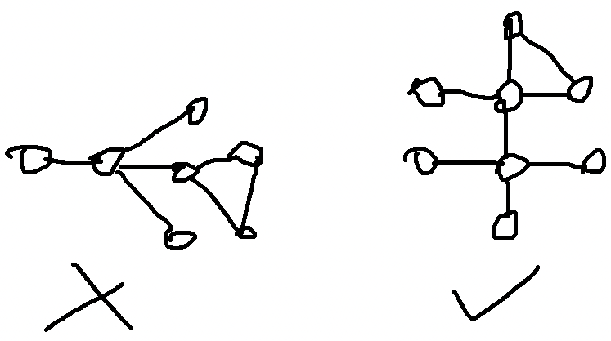

[link back to all posts](https://alxwen711.github.io/blog)

## April 1st-15th

It is currently May 2nd as of posting this. I’ll keep this short and just say that finals, applying to co-op, and then tooth extractions somewhat caused this delay. That however is not much of the matter for this log, and while my memory of these 5 contests is somewhat faded, there are some important points that need to be noted since the next few months will be crucial for my ICPC preparation; these contests do well for showing where I need to focus on.

### [CodeTON Round 4](https://codeforces.com/contest/1810)

Problems Solved: A, B, D, C

New Rating: **2002** (-78)

Performance: **1755**

[Regression towards the mean](https://en.wikipedia.org/wiki/Regression_toward_the_mean) was inevitable, but still unfortunate. The true tragedy of this contest though is that I will not be adding to my glorious wallet containing 2 TON coin.

In seriousness though, there is actual reason for this underperformance and things to learn from

Quick note on [D](https://codeforces.com/contest/1810/problem/D)

I just happened to see the solution on this problem faster than C, which is why I’m explaining my thought process here first. The idea is actually quite simple. For event 1, you just have to find the minimum and maximum possible heights of a snail and compute the overlap with your current range (note that initial starting range is set to [0,inf]). For event 2, there are simple math formulas to calculate the number of days the min/max height will take to climb, then just return said value if they’re equal. Note that even though one of the tags is binary search, this is unnecessary and while adding factor of log n to this solution will work with C++, it may not work in Python. Most likely it will, but it will likely be uncomfortably close to the time limit.

[Solution link](https://codeforces.com/contest/1810/submission/199993019)

And then we go to [C](https://codeforces.com/contest/1810/problem/C). This problem took nearly an hour to solve. Actually to correct myself, this problem took half an hour to understand properly and about 20 minutes to actually solve. This is what happens when you inexplicably think a permutation from 1 to n has to be increasing only, ie. `1 2 3 4 5… n`. My actual solution is much simpler and is [here](https://github.com/alxwen711/contestSubmissionArchive/blob/main/codeforces/live%20contests/2023-1/TON%204/c2.py), but here is [my first attempt](https://github.com/alxwen711/contestSubmissionArchive/blob/main/codeforces/live%20contests/2023-1/TON%204/c.py) where I was progressing towards the more restrictive variation of this problem. Excuse the profanity in the solution though. I can only assume that when I was in this contest over 3 weeks ago I was a tad infuriated at not reading the problem correctly. AGAIN.

### [Round 862](https://codeforces.com/contest/1805)

Problems Solved: A, B, C

New Rating: **1932** (-70)

Performance: **1710**

[Problem D](https://codeforces.com/contest/1805/problem/D) is a tree problem. That alone should tell enough about how I significantly dropped rating here. I may be able to solve A through C at a very fast pace (22 minutes) but its clear these sort of tree problems are still a brick wall for me. From looking at the failed test cases this wasn’t even really an implementation issue, I seemed to not exactly have the correct idea in the first place. If I recall correctly, based on the comments left my thoughts were based around finding the furthest distance for each given node, ie. tracking the longest distance found in a BFS search from each starting node. Either I implemented this part incorrectly, or my thoughtline here is wrong in that this is a way to overcount the number of segments.

### [Educational Round 146](https://codeforces.com/contest/1814)

Problems Solved: A, C

New Rating: **1932** (0)

I was saved by this contest being unrated. The only reason I was still CM after this contest was because Problem D had a technical judging error. Not that it really mattered for me in this contest because I ended up imploding on [Problem B](https://codeforces.com/contest/1814/problem/B). In fairness, I did make the correct strategy call by solving [C](https://codeforces.com/contest/1814/problem/C) very quickly. That is the only part that went correctly in this contest. B is somewhat gimmicky, with some experimentation you can determine that the optimal step length will be around the sqrt of the distance. There is always an optimal step length as if you let the horizontal and vertical steps needed be an+b and cn+d, where a,b,c,d are ints and b,d < n, then you can just increase the step size from 1 to b or d to make both distances a multiple of n. The issue here is that this optimal step size method will lead to the best answer each time, but the optimal step size is not always at the sqrt. It’s not even a rounding case; the optimal step size could be significantly off of the sqrt of the total distance. Pretty much this was happening:

The one thing we can use here is a ternary search to limit the range of values to a certain range. As for what exactly that range is though is uncertain, my code succeeded with testing 1000 values but fails with testing 10 values, and really the only thing I can take from this is to not assume on easy problems; the optimal value graph not being a smooth parabola feels very weird but with more careful test case experimentation I probably figure this out.
### [Round 864](https://codeforces.com/contest/1797)

Problems Solved: A, B, C

New Rating: **1912** (-19)

Performance: **1852**

[C](https://codeforces.com/contest/1797/problem/C) is actually a very nice problem that just about sums up how triangulation works, just instead of finding the intersection of 3 circles, you find the intersection of 3 squares. There are several ways to choose the points for the triangulation process but I found the simplest to involve taking the top left and bot left corner, and from there either the row or column (or both) locations of the king are known, for which the 3rd point can be chosen trivially. In this case [my solution](https://codeforces.com/contest/1797/submission/201299864) explains my thought process reasonably well; `lines` wasn’t actually used in the solution but is useful to show the possible locations the king could be based on the first 2 queries.

[D](https://codeforces.com/contest/1797/problem/D) on the other hand was tree hell. My logic in the [attempt](https://codeforces.com/contest/1797/submission/201348608) might have had some correctness to it, but main issue here was implementing. This is partially a deficiency in my code library regarding graphs in general and the fact that I’m not very good with graphs to begin with.

Overall in this contest, it was still a decent result mainly due to me working out C very effectively. I would say something about trees still being weak here but at a certain point the repetition is too much and I want this log to not be delayed further.

### [Round 865 (Div 1)](https://codeforces.com/contest/1815)

Problems Solved: A, B

New Rating: **1889** (-23)

Performance: **1816**

My first ever Division 1 contest, and to not much surprise I get pummelled out of CM again. Interestingly enough there is a chance my overall performance would’ve been higher had I competed in Division 2 due to fewer solves on [B](https://codeforces.com/contest/1815/problem/B) (D in Div 2), but this is heavily speculative since I ended solving these 2 questions with only 7 minutes left in the contest. Even if I dropped this honestly wasn’t a bad contest. [A](https://codeforces.com/contest/1815/problem/A)’s only real mistake was that I was way too trigger happy with my submissions, which I attribute to my mentality. This is a Div 1 contest, so the A problem is normally what I’d find as Problem C, but due to past experience I ended up treating this like a Div 2 Problem A, which resulted in several blatantly simple and wrong submissions. The actual solution just requires observing the differences between consecutive values and is pretty simple, but it isn’t “rush Problem A in 5 minutes” simple.

More importantly, B was myself struggling for an hour, realizing the solution suddenly, and then for once actually not tripping over myself in implementation. I will just say that the hardest part is trying to figure out what `+` queries to make, and then once you do, the `?` queries are MUCH simpler.

+ queries to use, and B’s solution in general

Only 2 + queries are needed: n and n+1. You can experiment with a few cases of n here but each one will result in the graph becoming a straight line. You then use n-1 queries of (1,2), (1,3), (1,4)..., (1,n) to determine one of the endpoints of the graph (i value where (1,i) results in the greatest distance), then n-1 more queries can be used from (i,j), 1 <= j <= n, j != i to figure out the full chain. Two guesses are allowed since reversing the chain order is also a possible solution.

On one hand these last two weeks were brutal as I lost 191 elo over 4 rated contests, and it probably would’ve been more had e146 been rated. That said, this was coming off of two of my greatest contests of all time, and performance wise this wasn’t terrible, just mid. I had some good moments in these contests but there is still much work to be done. Speaking of, my plan for the next few months. The next ICPC contest is going to be in October, and while this isn’t the only goal for me to prepare for over the next few months, it is one of the main ones. I am taking a heavy preparation method that involves several different contest types mainly to be prepared for any sort of question. This will mean I still continue with normal CF contests, but will also include a ICPC practice contest on the weekends, something I was doing in March but then had to delay because school happened. I’m also going to have time for the CodeChef contests on weekends, but will be using an alt account for those since that would be a faster way to actually reach the problem difficulty that I’m supposed to be doing. Lastly if time persists I also go through Leetcode competitions, mainly focusing on hard difficulty to learn advanced techniques. There are a few other details to this plan but I’ll mention them when relevant.

## April 16th-30th

At last I’ve once again caught this log up to date. Not much else needs to be said.

### [Educational Round 147](https://codeforces.com/contest/1821)

Problems Solved: A, C, B, D

New Rating: **1861** (-23)

Performance: **1772**

Before I begin properly recapping this contest, allow me to describe how problems are rated by difficulty on CodeForces. Simply put, a problem’s difficulty is somewhat based on ELO where for a person of x rating, in a live contest, they would have an expected 50% chance of solving a problem rated x. If the user’s rating is higher this probability increases and vice versa. More specifically, the chance of a person rated x solving a problem rated y is equal to 1 in 1+z, where z is 10^(y-x)/400. As for how problem difficulty is determined, the results after the contest can be directly used; for instance if it happens that around half of people rated about 1500 solve problem C, then problem C will probably be rated around 1500. Note that this exact rating can be skewed in both directions depending on who solves the questions; for instance, a problem could be rated 2800 with the idea that one needs to be around 2800 to have a 50% solve chance, but in practice it could be that only a small fraction of people at 2800 can actually solve the problem, but there are more people than expected at lower ratings that can solve it. Pretty much, the problem rating shown is the expected rating where one has a 50/50 of solving it, but the actual distribution of clear rate can be easily skewed.

With that all said, this may partially be why I somehow dropped rating even though [D](https://codeforces.com/contest/1821/problem/D) is a 1900-rated problem I quite literally completed in the final minute. In all honestly the way I stumbled through this contest is aggravatingly good in the sense that yes, I did solve A through D, but it was with a comical number of wrong submissions. 

 Optimal method for D 

The optimal solution is to greedily fill in segments except for some 1-cell and 2-cell spots; these ones need to be deallocated greedily as well. The logic behind this is that you want to always fill in a segment in full unless it’s longer than the number of cells needed, since it takes 2+n moves to fill in a segment of n cells. Skipping a 1 cell block saves 2 moves from pressing and releasing shift, but then you need another step at minimum to refill the cell. Note this additional cost only exceeds 1 move if another segment is needed. The idea is similar for 2-cell blocks except the only reason those are skipped are for the potential of having more 1-cell blocks to skip in the process.

The way I implement the above is to count the number of moves needed if cells are chosen greedily, ie. the earliest n cells are filled, while also tracking the number of 1-cell and 2-cell blocks covered. I then calculate the decrease or increase in cost by removing 1-cell blocks, or 2-cell blocks if no 1-cell blocks remain, adjusting the lowest move count as needed. The algorithm ends when no more blocks can be removed for whatever reason, or there aren’t enough cells to begin with, thus resulting in -1.

Much of the above thought process came through several wrong submissions, which is fair, but the last 4 in particular were in a 15 minute timespan. This is pretty much panic submitting, although in fairness, I did get the solution, [even if the code looks like this.](https://codeforces.com/contest/1821/submission/202881216) In completing this solution, I have shown that Python should be compared to C++ as an equal language for competitive programming, in the sense that both languages are equally capable of resulting in the most inexplicably unreadable speedcode that somehow works.

Wait I’m also supposed to talk about what happened with [B](https://codeforces.com/contest/1821/problem/B)? About that. My first idea involved finding the longest subsequence in array B that could be the result of sorting subsequence A. The actual answer I figured after easily solving [C](https://codeforces.com/contest/1821/problem/C) was to find the first and last indices where the arrays differed and then extend that range’s endpoints if it meant the segment in B was still sorted. It just happens sometimes I completely have the wrong initial idea for an easy question. At the very least I didn’t implode that badly there, but screwing B up like that is out of character for me. Anyways, this contest really was something with the B kerfuffle and D being down to the final minute in a literal sense. Maybe the next contest will be more of a normal experience.

Oh who am I kidding. I already did the next contest and I already know the insanity it was.

### [Round 869](https://codeforces.com/contest/1818)

Final stats for this contest

Problems Solved: A, B, C, D

New Rating: **1883** (+22)

Performance: **1940**

Like my previous award winning (but not actually award winning) monologue of the greatest contest in [Polynomial Round 2022](https://alxwen711.github.io/blog/Dec22#december-16th-31st) the final stats of this contest are hidden for dramatic effect.

We begin this contest of madness with completing Problems [A](https://codeforces.com/contest/1818/problem/A) and [B](https://codeforces.com/contest/1818/problem/B) in 9 minutes, unironically placing me in the top 5 of the eventual 7051 Division 2 competitors. If only the contest ended there. 

[Problem C](https://codeforces.com/contest/1818/problem/C) throws the first curveball in that it involves queries. This alone does not automatically make the problem complex, but my eventual solution ended up requiring use of a sparse table. This also happens to be my first main trouble moment. My initial solving idea was as follows:

Problem C Attempt 1

First mark off all the decreasing segments of the array of at least length 3. This was done by tracking each segment’s starting point and length, call this array A. Then for each query, find the decreasing segments fully contained in the range using array A. The number of forced deletions to make a decreasing segment legal is x-2, where x is the length of the segment. This computation can take O(n) for each query if the segments are just summed up normally, but that’s too slow, so a sparse table is created for array A to speed this up to O(log n) (a segment tree works as well). Lastly, the endpoints of the range might be in an unaccounted decreasing segment, so increment the answer as needed.

All the above took a while (37 minutes) to think out and looks perfectly reasonable except for the fact that it’s wrong. With 50 minutes in the contest already gone things aren’t looking great, but then I notice that [Problem D](https://codeforces.com/contest/1818/problem/D) is worth significantly more than C (2000 points compared to 1250 points). If I pull off D, I will at least beat most people who only get A through C and would then salvage this contest. Thus I swap to D.

D is a graph problem. Much pain was initially had, but then I actually figured out something.

Problem D’s Idea

Conveniently, n and m are limited to 2000, so an O(n+m) idea applied on each node can work. This is when we notice that a fish graph will always have a central node with a sole degree of 4. Thus, we first have to locate a node in the graph with degree at least 4. To determine the cycle, a BFS is used and each node is marked off with an integer representing its ancestor. In this case, the node that discovered node x in the BFS would be x’s parent, and x’s ancestor is determined by traversing x’s parents until a direct child of the central node is found. This detail is important to prevent the left case below from concluding there is a fish graph when there isn’t one.

If in this BFS an already discovered node is found AND it has a different ancestor from the current node, a fish graph exists. Recreating it is a matter of retracing the paths of both nodes back to the central node and then choosing two other children of the central node.

Unknown to me at this time was that this idea was actually correct. I began implementing it, and then remembered that for graphs, my implementation is otherworldly bad. With 38 minutes in the contest left I made [my first attempt](https://codeforces.com/contest/1818/submission/203947434), and proceeded to screw pretest 1. It turns out my code for some reason was not tracking used edges properly. Much laughter and pain was had, but now the contest was looking all but lost. I have only A and B solved at this point and could have potentially been facing a finish around rank 2000, a triple digit loss in ELO, and most painfully of all, yet another episode of ***Days of Our Programmers***. Seeing that C had many more solves now, I switch back to solving C, mainly due to having another possible idea:

Problem C Attempt 2

This time we assign a binary value to each element; 1 if it is part of a decreasing sequence of at least length 3, and 0 otherwise. This binary array will be called A Then for each query for range [a,b], find the sum of subarray A from index a+1 to b-1, call this value x. The answer is then b-a+1-x.

Compared to my previous idea, this feels completely wrong. Even at the time I thought this felt equivalent to my first idea. It turns out I have no idea what I’m talking about in this case because this actually ended up working. It wasn’t much to helping my ranking but at least I solved it. I figured I might as well look at D and figure out what was happening there. After a while I did fix an error where the BFS was reusing edges with [my second submission](https://codeforces.com/contest/1818/submission/203954004), but then another issue occurred where for some reason the code used to prevent same ancestor paths being used was not being triggered correctly. I only know this because thank goodness for assert statements in my [3rd submission](https://codeforces.com/contest/1818/submission/203955520). With 6 minutes left a debug attempt was basically impossible. At this point I quite literally went “screw it, if this is wrong, maybe try again or something, just make sure the code doesn’t return a faulty fish graph” and submitted a [4th time](https://codeforces.com/contest/1818/submission/203955520), containing code I knew was faulty.

Faulty code that somehow worked. Yep, I literally have a comment in this submission stating that something is bugged and somehow this dumb lucked into an Accepted verdict. I thought my code for Problem D in the previous contest was bad? [This](https://codeforces.com/contest/1818/submission/203955933) is psychotic. I cleared A and B in the first 10 minutes and cleared C and D in the final 20 minutes. There was clean execution and incredibly scuffed completion. This contest I went from being at the front to nearly collapsing in the midpack to somehow pulling out a top 300 finish. It really is the definition of aggravatingly good in the sense that I actually pulled off an incredible contest, but only through several minor heart attacks with how this contest played out.
