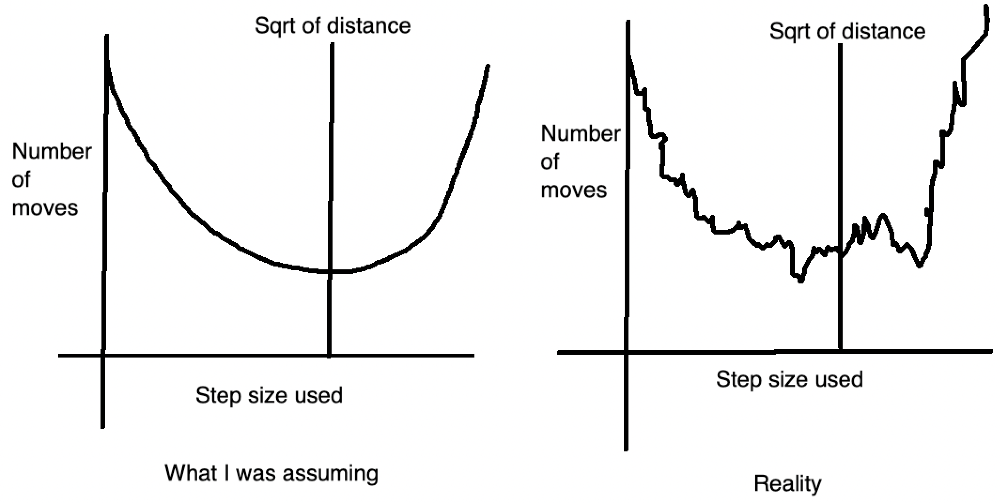
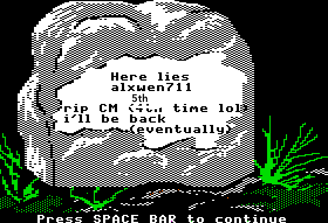

[link back to all posts](https://alxwen711.github.io/blog)

## April 1st-15th

It is currently May 2nd as of posting this. I’ll keep this short and just say that finals, applying to co-op, and then tooth extractions somewhat caused this delay. That however is not much of the matter for this log, and while my memory of these 5 contests is somewhat faded, there are some important points that need to be noted since the next few months will be crucial for my ICPC preparation; these contests do well for showing where I need to focus on.

### [CodeTON Round 4](https://codeforces.com/contest/1810)

Problems Solved: A, B, D, C

New Rating: **2002** (-78)

Performance: **1755**

[Regression towards the mean](https://en.wikipedia.org/wiki/Regression_toward_the_mean) was inevitable, but still unfortunate. The true tragedy of this contest though is that I will not be adding to my glorious wallet containing 2 TON coin.

In seriousness though, there is actual reason for this underperformance and things to learn from

Quick note on [D](https://codeforces.com/contest/1810/problem/D)

I just happened to see the solution on this problem faster than C, which is why I’m explaining my thought process here first. The idea is actually quite simple. For event 1, you just have to find the minimum and maximum possible heights of a snail and compute the overlap with your current range (note that initial starting range is set to [0,inf]). For event 2, there are simple math formulas to calculate the number of days the min/max height will take to climb, then just return said value if they’re equal. Note that even though one of the tags is binary search, this is unnecessary and while adding factor of log n to this solution will work with C++, it may not work in Python. Most likely it will, but it will likely be uncomfortably close to the time limit.

[Solution link](https://codeforces.com/contest/1810/submission/199993019)

And then we go to [C](https://codeforces.com/contest/1810/problem/C). This problem took nearly an hour to solve. Actually to correct myself, this problem took half an hour to understand properly and about 20 minutes to actually solve. This is what happens when you inexplicably think a permutation from 1 to n has to be increasing only, ie. `1 2 3 4 5… n`. My actual solution is much simpler and is [here](https://github.com/alxwen711/contestSubmissionArchive/blob/main/codeforces/live%20contests/2023-1/TON%204/c2.py), but here is [my first attempt](https://github.com/alxwen711/contestSubmissionArchive/blob/main/codeforces/live%20contests/2023-1/TON%204/c.py) where I was progressing towards the more restrictive variation of this problem. Excuse the profanity in the solution though. I can only assume that when I was in this contest over 3 weeks ago I was a tad infuriated at not reading the problem correctly. AGAIN.

### [Round 862](https://codeforces.com/contest/1805)

Problems Solved: A, B, C

New Rating: **1932** (-70)

Performance: **1710**

[Problem D](https://codeforces.com/contest/1805/problem/D) is a tree problem. That alone should tell enough about how I significantly dropped rating here. I may be able to solve A through C at a very fast pace (22 minutes) but its clear these sort of tree problems are still a brick wall for me. From looking at the failed test cases this wasn’t even really an implementation issue, I seemed to not exactly have the correct idea in the first place. If I recall correctly, based on the comments left my thoughts were based around finding the furthest distance for each given node, ie. tracking the longest distance found in a BFS search from each starting node. Either I implemented this part incorrectly, or my thoughtline here is wrong in that this is a way to overcount the number of segments.

### [Educational Round 146](https://codeforces.com/contest/1814)

Problems Solved: A, C

New Rating: **1932** (0)

I was saved by this contest being unrated. The only reason I was still CM after this contest was because Problem D had a technical judging error. Not that it really mattered for me in this contest because I ended up imploding on [Problem B](https://codeforces.com/contest/1814/problem/B). In fairness, I did make the correct strategy call by solving [C](https://codeforces.com/contest/1814/problem/C) very quickly. That is the only part that went correctly in this contest. B is somewhat gimmicky, with some experimentation you can determine that the optimal step length will be around the sqrt of the distance. There is always an optimal step length as if you let the horizontal and vertical steps needed be an+b and cn+d, where a,b,c,d are ints and b,d < n, then you can just increase the step size from 1 to b or d to make both distances a multiple of n. The issue here is that this optimal step size method will lead to the best answer each time, but the optimal step size is not always at the sqrt. It’s not even a rounding case; the optimal step size could be significantly off of the sqrt of the total distance. Pretty much this was happening:

The one thing we can use here is a ternary search to limit the range of values to a certain range. As for what exactly that range is though is uncertain, my code succeeded with testing 1000 values but fails with testing 10 values, and really the only thing I can take from this is to not assume on easy problems; the optimal value graph not being a smooth parabola feels very weird but with more careful test case experimentation I probably figure this out.
### [Round 864](https://codeforces.com/contest/1797)

Problems Solved: A, B, C

New Rating: **1912** (-19)

Performance: **1852**

[C](https://codeforces.com/contest/1797/problem/C) is actually a very nice problem that just about sums up how triangulation works, just instead of finding the intersection of 3 circles, you find the intersection of 3 squares. There are several ways to choose the points for the triangulation process but I found the simplest to involve taking the top left and bot left corner, and from there either the row or column (or both) locations of the king are known, for which the 3rd point can be chosen trivially. In this case [my solution](https://codeforces.com/contest/1797/submission/201299864) explains my thought process reasonably well; `lines` wasn’t actually used in the solution but is useful to show the possible locations the king could be based on the first 2 queries.

[D](https://codeforces.com/contest/1797/problem/D) on the other hand was tree hell. My logic in the [attempt](https://codeforces.com/contest/1797/submission/201348608) might have had some correctness to it, but main issue here was implementing. This is partially a deficiency in my code library regarding graphs in general and the fact that I’m not very good with graphs to begin with.

Overall in this contest, it was still a decent result mainly due to me working out C very effectively. I would say something about trees still being weak here but at a certain point the repetition is too much and I want this log to not be delayed further.

### [Round 865 (Div 1)](https://codeforces.com/contest/1815)

Problems Solved: A, B

New Rating: **1889** (-23)

Performance: **1816**

My first ever Division 1 contest, and to not much surprise I get pummelled out of CM again. Interestingly enough there is a chance my overall performance would’ve been higher had I competed in Division 2 due to fewer solves on [B](https://codeforces.com/contest/1815/problem/B) (D in Div 2), but this is heavily speculative since I ended solving these 2 questions with only 7 minutes left in the contest. Even if I dropped this honestly wasn’t a bad contest. [A](https://codeforces.com/contest/1815/problem/A)’s only real mistake was that I was way too trigger happy with my submissions, which I attribute to my mentality. This is a Div 1 contest, so the A problem is normally what I’d find as Problem C, but due to past experience I ended up treating this like a Div 2 Problem A, which resulted in several blatantly simple and wrong submissions. The actual solution just requires observing the differences between consecutive values and is pretty simple, but it isn’t “rush Problem A in 5 minutes” simple.

More importantly, B was myself struggling for an hour, realizing the solution suddenly, and then for once actually not tripping over myself in implementation. I will just say that the hardest part is trying to figure out what `+` queries to make, and then once you do, the `?` queries are MUCH simpler.

+ queries to use, and B’s solution in general

Only 2 + queries are needed: n and n+1. You can experiment with a few cases of n here but each one will result in the graph becoming a straight line. You then use n-1 queries of (1,2), (1,3), (1,4)..., (1,n) to determine one of the endpoints of the graph (i value where (1,i) results in the greatest distance), then n-1 more queries can be used from (i,j), 1 <= j <= n, j != i to figure out the full chain. Two guesses are allowed since reversing the chain order is also a possible solution.

On one hand these last two weeks were brutal as I lost 191 elo over 4 rated contests, and it probably would’ve been more had e146 been rated. That said, this was coming off of two of my greatest contests of all time, and performance wise this wasn’t terrible, just mid. I had some good moments in these contests but there is still much work to be done. Speaking of, my plan for the next few months. The next ICPC contest is going to be in October, and while this isn’t the only goal for me to prepare for over the next few months, it is one of the main ones. I am taking a heavy preparation method that involves several different contest types mainly to be prepared for any sort of question. This will mean I still continue with normal CF contests, but will also include a ICPC practice contest on the weekends, something I was doing in March but then had to delay because school happened. I’m also going to have time for the CodeChef contests on weekends, but will be using an alt account for those since that would be a faster way to actually reach the problem difficulty that I’m supposed to be doing. Lastly if time persists I also go through Leetcode competitions, mainly focusing on hard difficulty to learn advanced techniques. There are a few other details to this plan but I’ll mention them when relevant.

## April 16th-30th

