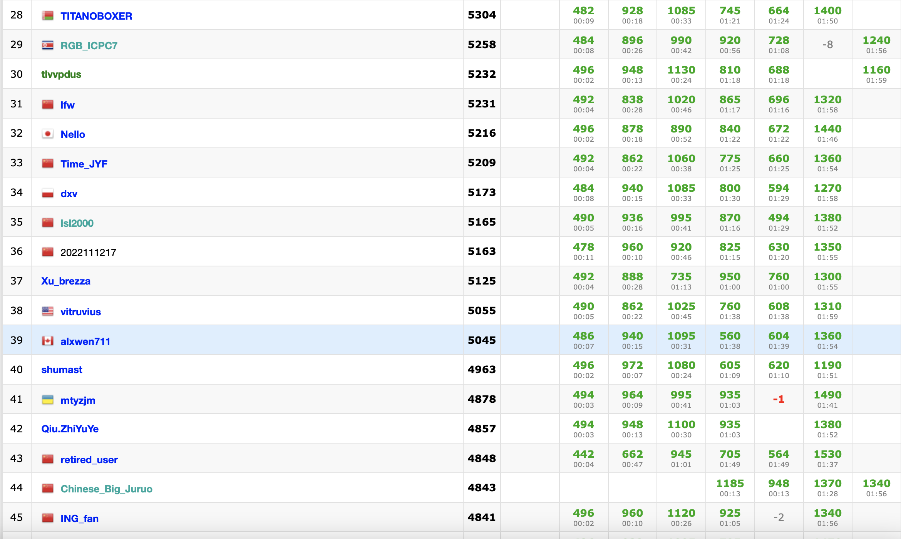

[Link back to all posts](https://alxwen711.github.io/blog)

## August 1st-15th

After last post’s 6 contest ficaso, and recent personal entries taking 9 eternities to complete, I’m now trying to write this post faster than normal. This is so that I force myself not to ramble endlessly in these logs and in upcoming weeks my school schedule means I will not have as much time to write these posts. Hopefully I can still go into reasonable depth in my contest recaps, speaking of, there are three here:

### [Educational Round 133](https://codeforces.com/contest/1716)

Problems Solved: A, B, C

New Rating: **1883** (+20)

Performance: **1937**

I have made several references to “SpeedForces” and this contest was a prime example of this. When [Problem A](https://codeforces.com/contest/1716/problem/A) has 14265 solves from Division 2 competitors and [Problem B](https://codeforces.com/contest/1716/problem/B) has 12524 solves, how many people would you think solved [Problem C](https://codeforces.com/contest/1716/problem/C)? The fact that I even gained 20 ELO from this contest despite only solving 3 problems says everything about the difficulty gap between C and D. Problems C and D had a similar 800ish number of solves. Speed is not usually a skill to focus on for competitive programming, but it ends up being crucial when 80% of the rankings are determined by who solved the first two problems faster.

All of the problems after B happened to be dynamic programming problems. For C the solution is based around noticing there are only two types of paths the robot can take:

1. A snaking path that prioritises finishing each column. From the robot’s start position this would be down, right, up, left moves repeated.

2. A looping path that prioritises finishing each row. From the robot’s start position this would be going right as far as possible, down, then left as far as possible.

Calculating the time to snake across any given number of rows using dp is relatively simple, but for the looping path, the time taken to loop across the last x columns has to be calculated. On top of that, 2. describes a clockwise looping pattern; the counterclockwise looping pattern also needs to be calculated. With all of this the time required for all given paths can be calculated since any possible robot path is either fully snaking, fully looping, or a combination of snaking the first x columns and looping the rest.

Then there is [Problem D](https://codeforces.com/contest/1716/problem/D). In the contest I spent most of the remaining time trying to work out some sort of dp idea by writing out various patterns to no avail. With `k = 1` I ended up with the sequence `1 1 2 2 3 4 5 6 7 10 12 15` and I still have no clue what the generating method is. Interestingly both C and D were 2000-rated problems. Even though both were around the same “difficulty”, I had widely varying success on them, which shows that I can solve <span style="color:purple">**Candidate Master**</span> level problems, just inconsistently. This contest also puts me in legitimate striking range of reaching 1900 ELO in the next contest, as my calculations find that I only require a similar performance of 1945 ELO to reach the goal.

### [Round 812](https://codeforces.com/contest/1713)

Problems Solved: A, B, C

New Rating: **1857** (-26)

Performance: **1775**

This was a choke. I finished the first three problems in 22 minutes and all I needed was [Problem D](https://codeforces.com/contest/1713/problem/D). I even figured the right method to eliminate two contenders with each guess so I had the right algorithm in place. Where [my submission](https://codeforces.com/contest/1713/submission/167303965) failed was in the implementation, which inexplicably was calling too many queries. I’m still in striking distance of <span style="color:purple">**Candidate Master**</span>, but now need a 2012 ELO performance for glory.

### [Round 813](https://codeforces.com/contest/1712)

Problems Solved: A, B, C

New Rating: **1834** (-22)

Performance: **1766**

What happened here was a combination of the previous two contests. A similar strong start to Round 812 with Problems A through C solved in 25 minutes, the difficulty gap from C to D being nuts like Educational Round 133 due to the number of solves going from 8578 to 763, and then the contest finishing like Round 812 did with possibly a choke. [Problem D](https://codeforces.com/contest/1712/submission/168175221) was the question where I collapsed, and guess what? It’s another graph problem. I ended up having a TLE result here so I’m not entirely sure if my solution was too slow or wrong.

#### August 15th Update 

Turns out for [Problem D](https://codeforces.com/contest/1712/submission/168175221) I really am unsure how to solve this. My [in contest submissions](https://codeforces.com/contest/1712/submission/168175221) likely TLEd because using a segment tree for minimum queries is O(log n), but with 1.5 seconds and n = 100000, this time limit is very iffy. Using a sparse table with O(1) minimum queries reduced the runtime but resulted in [WA verdict](https://codeforces.com/contest/1712/submission/168435686). This could be because I am assuming paths like 1->2->5 will always be less expensive than 1->3->2->5, ie. the shortest path contains at most 2 edges. Having spent three hours on this problem and still not making any progress, only now I decide to look at the tutorial just to see how close I actually was in solving the problem. And it turns out that the easiest method to solve this is to binary search for the answer. 

```python
def solution(id: char):
	if id == "A" or id == "B": return simpleStuff()
	elif id == "E" or id == "F": return complexStuff()
	else: return "binary search the answer"

if solution(failedQuestion.id) == "binary search the answer":
	print("Pain.")
```

Pain. In my last 10 contests, I have dropped ELO 6 times. Half of those times were because of scuffed greedy solutions when binary searching for the answer would have been much simpler. Now I need a 2072 performance for glory, effectively meaning I need another breakout run.

It is true there are still 4.5 months left for me to reach <span style="color:purple">**Candidate Master**</span> this year. My original goal was <span style="color:blue">**Expert**</span> but was changed due to me reaching this back in April. The real issue is the upcoming school term. In earlier logs I mentioned I was seeking co-op, but these plans changed, mainly because there were many courses I could take this term that I have been waiting for months to get, and in all honesty, I did not feel ready for co-op. The Fall 2022 academic schedule, which will contain 6 courses, is my own decision. Combined with external projects I’m planning to post on my Github, I will not have the luxury of being able to attend every CodeForces contest scheduled. In September to December, there may be 10 contests that fit in my schedule if I’m lucky; any other contests will be the result of suboptimal circumstances. So the next three contests are vital, as they will be my best chances to attain <span style="color:purple">**Candidate Master**</span> this year.


## August 16th-31st

These two weeks effectively act as Judgement Day. Routine competitive practice will be impossible after this with a course load that is just a “bit” difficult, so these next contests are crucial as to if I’ve attained <span style="color:purple">**Candidate Master**</span>, placed myself in very close striking range for the few contests I have left this year, or killed off any chance of reaching this goal with untimely collapses. 
### [Round 814](https://codeforces.com/contest/1719)

Problems Solved: A, B, C, D1, D2, E

New Rating: **1981** (+147)

Performance: **2363**




Holy hell I did it. The only “downside” from this contest was that I was not able to participate in Rounds 815 and 816 due to oversleeping for both of them, but screw that. I’ve reached <span style="color:purple">**Candidate Master**</span> in 8 months! Bring out the champagne!


So how exactly did this happen? Problems A and B were pretty easy, and I figured out the only trick in [Problem C](https://codeforces.com/contest/1719/problem/C) being that once the strongest player is in the match, they’ll win all of the remaining fights, so only the fights up to that one have to be calculated. [Problem D](https://codeforces.com/contest/1719/problem/D1) was a harder problem where I made several greedy attempts that failed first, but unlike previous contests where I would make small tweaks each time hoping that I on the right idea, I made several attempts with significant changes each time, even trying a dp idea in one attempt ([Submission History](https://codeforces.com/contest/1719/status)). The I found for solution for D can actually be summarised in one sentence:

<details> 
<summary>Problem D solution </summary> 
`Minimum time = Array length - maximum number of subarrays that can be created out of array where xor of all the elements is 0` 
</details>

The only difference between D1 and D2 is runtime constraints, D1 can allow O(n^2) while D2 needs at least O(n log n). My implementation runs in O(n) time, and in fairness, this extra constraint did not really affect the problem much, as the rating difference between the easy and hard versions was only 100 ELO.

The true breakout that led to an <span style="color:orange">**International Master**<\span> level performance was in [Problem E](https://codeforces.com/contest/1719/problem/E). In this case, the problem is solvable via greedy method, so all that is required to check is if the letter count matches the sum of the first x Fibonacci numbers, and then to assign each Fibonacci number from highest to lowest to the highest value remaining without repeating letters twice. I did not expect to solve this question in 15 minutes, and to be honest, it was easier for me compared to D, but it is my first ever E solve in a Division 2 contest. This question also happened to be only Problem B in Division 1 (usually it would be C), so that may explain how I somehow got this question so fast.


Each point on this graph represents a contest in the last 8 months, with the first 5 contests being excluded since my rating there was provisional. From being on the 1400 ELO borderline between <span style="color:green">**Pupil**<\span> and <span style="color:cyan">**Specialist**<\span> in February and March, to climbing and maintaining <span style="color:blue">**Expert**<\span> in May and June, to now reaching <span style="color:purple">**Candidate Master**<\span> is a nice climb. The journey however is still not over yet, as technically, I’m still a candidate. Being an actual “master” of competitive programming at 2100 ELO would be fun. I’m unsure if I can reach that by the end of this year with my upcoming school term limiting the quantity of contests I can partake in, but I sure as hell will try. Also, I’m working on two special posts to be up (eventually) reflecting my first year on CodeForces and what each rating in CodeForces means, 2022 edition.


