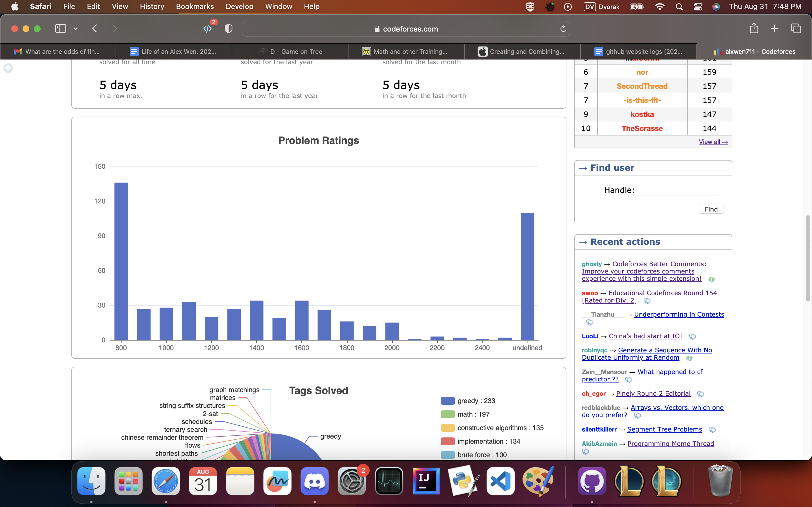

[link back to all posts](https://alxwen711.github.io/blog)

## August 1st-15th

Yep, it’s time for another quality recap of codeforces contests.

### [Round 890](https://codeforces.com/contest/1856)

Problems Solved: A, B, C, E1

New Rating: **1973** (+21)

Performance: **2014**

Statistically, my performance here was mediocre. [Problem D](https://codeforces.com/contest/1856/problem/D) was legitimately harder than [Problem E1](https://codeforces.com/contest/1856/problem/E1), and I have to give credit to the contest setters for this contest had one of the most balanced difficulty curves, which is impressive considering the last problem was in multiple parts. Overall pace was okay, nothing out the ordinary, but I was still relatively capped out by the harder problems.

That said, [Problem C](https://codeforces.com/contest/1856/problem/C) was a glorious act of revenge. 

<details>
<summary>Ha ha ha. I got C.</summary>

To quote a rant in a very recent log entry:

_RUN O(N) TESTS TO BINARY SEARCH THE ANSWER. This pattern has shown up OVER and OVER again and for TWO hours I did not even bother considering it. It’s one of the most fundamental patterns in these problems, and shows up nearly every contest, and I decided that going for an approach that is `O(way too long)` was a better solution. And look where I am now. I’m basically back at the same level as the start of the year, hell even the summer of last year. This is a wakeup call. The last thing I want is another failure in October’s regionals, but repeating these blunders and idiocy is simply insanity. Actually goose egging a contest. What a bloody joke._

Let’s just say the wake up call happened here. The LT Binary pattern (Linear Trial Binary, that’s what I’m calling it now) was used for this solution. It took me a while to figure out, but if we assume that the maximum possible value is `x`, then a maximum of `x-1,x-2,x-3…` are all attainable. The challenge is determining if a such maximum is possible, but for this you can attempt to make each value in the array the maximum. Due to n being at most 1000, such a $O(n^2 log n)$ solution can work. Then to determine the minimum number of operations needed to make index i value x or higher, it goes as follows:

Suppose c is tracking the total operations needed. Add x-ar[i] to c, then check if the next value would’ve needed increasing to make this move work (ie. check if ar[i+1] >= x-1). If so, then add the required ar[i+1] operations needed and then check if ar[i+2] would need additions. Repeat until c is determined or you require ar[-1] to be increased; in this case, making ar[i] = x is impossible.

[solution link](https://codeforces.com/contest/1856/submission/217306814), `inc` tests a specific value in the array if it can be equal to x, `f` just runs `inc` on each element in the array, and `b` is the binary searching mechanism. Anyways, please excuse me as I celebrate that I got my revenge on a LT Binary problem.

</details>


### [Round 892](https://codeforces.com/contest/1859)

Problems Solved: A, B, C, D

New Rating: **2064** (+91)

Performance: **2299**

I won the first half of the contest! Then [E](https://codeforces.com/contest/1859/problem/E) happened which was kinda unfortunate. I first solved it if only at most 2 segments could be used, then solved it if the segment had to be a contiguous range. Both used a contiguous dp so I sort had the right idea, but couldn’t see how to optimize it from some $O(n^3)$ ideas I tried. A-D though in 1 hour, and A-C in particular in 17 minutes is exceptional pace. This sort of rating gain based on fast A-D with constantly missing E as skill cap might be somewhat unsustainable, but it’s still solid rating gain for an overall solid contest.


<details>
<summary>D thoughts</summary>

The idea of [D](https://codeforces.com/contest/1859/problem/D) is that some of the portals could connect to each other, for instance, a portal where you enter through [1,6] and exit through [4,5] can connect to a portal where you enter [5,12] and exit [9,11]. You want to track the minimum required position to be able to use the portal sequence to reach a further point. In this case you can track that as long as your position is at least 1, you can use the portals to reach 11. Eventually you will have several of these pairs of min entry points and maximum portal exits, for which you then use binary search on each starting pos to find maximum position. Note that using no portals is also an option, above example a starting position of 12 is a case of this.

There is one more part to consider in this for implementation, being how to know that for a given minimum entry point, you are reaching the absolute furthest point. What I did here was to keep all of the reachable unchecked entry points for a given segment chain in a heap structure. I would then check if the current entry point of the given segment is lower than the given portal segment, and if so, remove it from the heap to take the next segment to the right for comparison. Only when no segments remain in the heap do we know the furthest point has been reach, meaning we can create a new portal segment.

[Solution link](https://codeforces.com/contest/1859/submission/218547795)

</details>
### [Round 893](https://codeforces.com/contest/1858)

Problems Solved: A, C, B

New Rating: **1998** (-67)

Performance: **1786**

This is what I meant by my previous gains being unsustainable. There is the small caveat that I mainly lost rating because I spent half an hour on [B](https://codeforces.com/contest/1858/problem/B) before noticing that [C](https://codeforces.com/contest/1858/problem/C) was much easier, but blaming this is a pitfall. Firstly, this is more just bad strategy on my part; if B is 1250 points and C is 1500 points, it implies that their difficulties *should* be similar and I should’ve checked both of them first before running head first into B. Secondly, B only took that long with a wrong submission because I had very sloppy implementation. And lastly, all of these mistakes would have been negated had I solved [D](https://codeforces.com/contest/1858/problem/D). For this I’m still trying to upsolve it, and the plan is to start the next entry with how exactly this problem works.


## August 16th-29th

You might be wondering why I’m separating the last two days from this entry. I’ll explain after I recap the contests. I’m going to be real, the entirety of these 16ish days can be considered a quality episode of Days of Our Programmers. There was all sorts of drama involved.

### [Educational Round 153](https://codeforces.com/contest/1858)

Problems Solved: A, B, C, ~~D~~

New Rating: **1970** (-28)

Performance: **1881**

[D](https://codeforces.com/contest/1860/problem/D) I genuinely have no idea how it made it past the pretests. After the contest when hacks started occurring, I knew that my scuffed greedy method was wrong since every correct submission utilized an O(n^3) dp. There’s a sort of dignity in being hacked when you know your submission is wrong (thank you iFFT) rather than being forced to agonize for 12 hours for the inevitable result. Really, the only problem I did well on was [C](https://codeforces.com/contest/1860/problem/C). [B](https://codeforces.com/contest/1860/problem/B) had 1 WA due to egregious typo, and [A](https://codeforces.com/contest/1860/problem/A)’s saving grace was that it only took 2 WAs for me to figure out the n=2 edge cases. Had this not been an educational contest, my rating loss would’ve been greater, and really, this contest was a mess ended in dignity.

I guess at least I did A through C relatively quickly?


### [Harbour 2023](https://codeforces.com/contest/1858)

Problems Solved: A, C, B, D, E*

New Rating: **2039** (+69)

Performance: **2216**

Okay, this contest was something. This open competition consisted of 9 problems to be solved in 3 hours, and after [A](https://codeforces.com/contest/1864/problem/A) is when things started going a bit nuts. I skipped [B](https://codeforces.com/contest/1864/problem/B) initially not because I didn’t know how to solve the problem, but more because I wasn’t sure if my solution was correct. I also took into consideration the scoring system and decided that attempting [C](https://codeforces.com/contest/1864/problem/C) was a safer option. Looking back submitting B first before trying C would’ve scored a few more points, but the difference in rank is negligible and I went for C over B as a safety valve, so it’s a reasonable strategy. [D](https://codeforces.com/contest/1864/problem/D)’s single trick is to get the runtime from $O(n^3)$ to $O(n^2)$, and I figured out the system for this relatively quickly ([D submission](https://codeforces.com/contest/1864/submission/220556119))

And then there’s [E](https://codeforces.com/contest/1864/problem/E).

<details>
<summary>Oh boy. E.</summary>

With this problem, we need to first understand what Alice and Bob’s optimal strategy is. In this case, it is easiest to write both of their numbers in binary. With Alice’s first turn, she looks at the most significant 1 bit in a | b. If her value does not contain a 1 in that significant bit, then she knows a < b, otherwise she passes. This then goes to Bob, who knows Alice must have a 1 in that position. If Bob doesn’t have it, then a > b. Otherwise, Bob can begin comparing his value to the 2nd most significant 1 in a | b. This process repeats until all the bits in a | b have been compared; in this case, a = b.

This information allows us to tell how many turns a game will last. If we know the sum of turns of all $n^2$ possible games, then expected turn count is trivial. In this case, let’s suppose our values can be split into groups X and Y. All values in X have a 1 bit in their $2^29$ bit value (so values like 100000…0000 (29 0’s)), while values in Y do not. This gives 4 possible cases for how the game could play out:

1. Alice gets a value from X, Bob from X: They compare the first bit and continue the game (at least 2 moves)

2. Alice gets a value from X, Bob from Y: Bob determines a > b, game ends in 2 moves

3. Alice gets a value from Y, Bob from X: Alice determines a < b, game ends in 1 move

4. Alice gets a value from Y, Bob from Y: They don’t compare the first bit continue the game (at least 1 move)

Each of these cases are disjoint. Cases 1 and 4 can be directly added to the sum, while cases 2 and 3 are done recursively. Given the input size, a full tree would use about $2^30$ nodes, but with n being at most 200000, not all nodes will be required. In fact, by effectively [bucket sorting](https://en.wikipedia.org/wiki/Bucket_sort) these values, far fewer nodes are used. At ABSOLUTE worst, if somehow each value created 30 new nodes (which is still impossible), only 6 million nodes are created. Given the O(1) storage for each node, it would be close, but the time limit serves no problem here.

Note that I said time limit. In 99% of problems memory isn’t an issue, but apparently, my [first implementation](https://codeforces.com/contest/1864/submission/220570699) hit MLE. It took some optimization (mainly removing ONE piece of info from each node) of this solution to pass the 256MB memory limit. With specific values, enough nodes can be created to actually screw this limit, but I got ridiculously lucky with none of the main tests screwing me over. [I’m not joking, look at this.](https://codeforces.com/contest/1864/submission/220573750)

I really got hacked on this problem via MLE. But it happened after the contest so I still got the points. This is some next level luck. As for fixing this? I have an idea in mind where you pretty much do the calculations of the bucket search layer by layer so then only a single layer of the tree is stored at a time. It involves some scuffed dictionary implementation, but I’ll try this out after tomorrow’s Pinely contest.

</details>


Now as for why I’m getting this log out early:

[This contest.](https://codeforces.com/blog/entry/119770)

Yep.

Pinely Round 2. It’s time to get my revenge. Either way, we all know ***Days of Our Programmers*** is coming out of this.

[Context for the unaware, go to 2nd half](https://alxwen711.github.io/blog/Nov22)

## August 30th-31st

### [Pinely Round 2](https://codeforces.com/contest/1863)


***Days of Our Programmers: A Pinely Reunion***

*Tonight, on **The probable series 2 finale of DOOP,***

_The show prepares for a new story arc as the summer draws to a close. With a recent stroke of divine luck in recent memory somehow places the Dragon into striking distance for a return to the Master title, there is a greater event at hand to consider: the beginning of our protagonist’s coop learning journey. In the 20 months of writing this journal several attempts at coop were made, with little success. But it is now, that I can say that in two weeks time, I will be in a co-op with Global Relay. It brings into question the future of this fine show, for as much as I’d want to continue with the same time and drive for these competitions, I have been waiting for such a real world opportunity for a long time, arguably too long. It is finally time. With the incoming coop opportunity coming, our protagonist is more prepared than ever to make the upcoming contests count._

_Asides this brief sentimentality there is more pressing reason for the Dragon to fight in this next contest, for it is Pinely Round 2. For our frequent readers, you may recall the “contest” that was Pinely Round 1 back in November of 2022. It was the one where through a spectacular implosion losing 140 ELO, our protagonist was banished to a “special” place. As such, this contest has a lot riding on it. A chance for revenge. A meaningful finish to a potential competition hiatus. A true shot at returning to an orange username. There is no need to further delay, and the contest finally begins._

_The ordeal begins, and for a moment, silence. The silence of 13 and a half thousand competitors at their screens and our protagonist examining the [first problem](https://codeforces.com/contest/1863/problem/A). Then, the typing begins, and the Accepted verdicts flood the leaderboards. 8 minutes in, the Dragon finally strikes. Problem A falls, albeit a bit slower than expected. Then begins the [second problem](https://codeforces.com/contest/1863/problem/B). There’s a permutation, an old callback to great traumas of Div 2B permutation struggles in the past. For a singular moment, a slight pain strikes at the Dragon. In the first Pinely competition, this was when it all fell apart._

_It would not be the same today. The Dragon ices this challenge in 6 minutes, and with that, he exceeds his performance on the first Pinely competition. But a mere thirteenth of the time has passed. Our protagonist does not want more, he demands it, and thus the [third problem](https://codeforces.com/contest/1863/problem/C) commences. It’s an old classic in the Minimum EXcluded value of the array. A bit trickier, but then there is a clue within the constraints: for an array of n values, each of the values will be unique, and from 0 to n inclusive. Strangely enough, this means exactly 1 value between 0 and n will always be left out. Even more strange is when our protagonist experiments with the second testcase:_

```
Initial array: [0,1,3]
For k = 1: [2,0,1]
For k = 2: [3,2,0]
For k = 3: [1,3,2]
For k = 4: [0,1,3]
```

_A cycle. It gives critical insight to the answer, and through some basic modulo operations in his [solution](https://codeforces.com/contest/1863/submission/221114379), the Dragon claws through C. A mere 22 minutes have passed, and momentum in his wings build. Our protagonist is flying through this contest in great contrast to past failures, and now the [4th challenge](https://codeforces.com/contest/1863/problem/D) awaits. Presented in this problem is a rectangular board covered in horizontal and vertical dominoes. The question is to find a colouring such that the three pardigrams hold, or determine that such a colouring is impossible:_

```
I. Every domino must have 1 black cell and 1 white cell.
II. Every row must have the same number of black and white cells.
III. Every column must have the same number of black and white cells.
```

_Clearly, if only an odd number of cells in a row or column can be coloured, then no such configuration exists. Past that is a bit more complicated, but the writer of this episode first thought of the most basic case of a proper setup: two dominoes making a square:_

```
UU
DD
```

_Then our protagonist invents a new setup called a split square:_
```
U……..U
D……..D
```

_Here we can see this setup still works. It also functions similarly with horizontal dominoes. The key observation is that a proper setup must have all of its dominoes in these split square setups. The proof is a bit hard, but then we look at the first example:_

```
..LR..
ULRU..
DLRDUU
..LRDD
```

_The dragon then sees it. The dominoes are all in split square formation. Then the rest becomes relatively easy; by grouping dominoes by their row/column position, they could be formed into split squares. Then it’s a matter of making sure dominoes in split squares are coloured opposite to each other. With this dagger, our protagonist defeats D, and only 41 minutes in the contest have passed. He flies to the [fifth problem](https://codeforces.com/contest/1863/problem/E). Upon inspection, it is the greatest challenge the Pinely contest has posed yet: a pine tree problem._

Note: the problem isn’t actually about pine trees specifically. I just felt like putting in a terrible pun there.

_Here the reasonable idea of structuring the quests in a directed graph is made. Traversing downwards from the tasks with no prerequisites could setup a case where the last tasks are completed as early as possible, and thus this code is created. There is much scuffed code involved, and leads to the glorious success of `Wrong answer on pretest 2`._

_It turns out E is a difficult problem. No matter, for the first submission had legitimate error if the graph had multiple “head points”. Turns out this pine tree problem is less a tree and more a dense forest of bushes. It’s a simple fix, and using the technicalities of bfs it leads to: another WA on pretest 2. Frick. Our protagonist finds some actual struggle here, but then another consideration is made: what if the graph was traversed backwards? Suppose you knew that a quest that did not act as the prerequisite for any other quest was done at time x. Based on this information, you can determine the absolute latest time that its prerequisite quests would have to be completed. Thus, our protagonist begins going through the graph in reverse._

_It still does not work out. Twice. By this point 5000 seconds have been all but fried on this one question, and no one really knows what’s happening. In normal cases, this is when the contest would end in some middling futility, but Pinely demands more, thus this agony still has another hour to it. At this point, our protagonist goes “screw it”, and traverses the graph in both directions. This isn’t as ridiculous as it sounds since the top to bottom search sets up the minimum time needed to complete a quest, and the bottom to top search sets up the latest time a quest can be started. And yet this still fails. The remaining 2+ hours of the competition simply lead to 6 ways to get E wrong, and the contest ends._ It is at this point where as the writer, I must say I am quite disappointed with how this contest ended because it leaves no conclusive ending. Did I get revenge on Pinely Round 1? I mean, I still lost rating from this and that choke was painful, but this may as well be a small inconvenience to the disastrous first round. Also, it’s not like I did bad the whole time, and by completing 4 problems, I did far better than what I did last year. It’s such an unsatisfying draw that simply requires another contest to decide. Maybe this is what fate had planned this whole time. Like the future being uncertain, so is this contest’s outcome, and the conclusion of this series of ***Days of Our Programmers***. 

Problems Solved: A, B, C, D

New Rating: **2022** (-17)

Performance: **1968**


Editor’s note: I really had no clue how to write a conclusion to this one. This is what happens when a seemingly critical contest of great importance ends up being incredibly mediocre.

### [Educational Round 154](https://codeforces.com/contest/1861)

Problems Solved: A, B, D, C

New Rating: **2000** (-22)

Performance: **1930**

This will be more on the brief side since the previous contest took a lot of time to dramatically recap, but I can reasonably say there is one very critical roadblock I’m facing now:




This chart shows the ratings of every problem I have ever solved on Codeforces, both in contest and in practice. The majority of these problems are from contests, with the unrated section mainly being from specific ICPC practice contests. Up to 2000 rating we can see each rating section have at least 10 problems solved, most hovering around 20 or higher. It’s normal for the frequency to drop with harder ratings, but the plummet past 2000 is too much. That is a clear pattern that I can consistently bricked on the harder 2Ds and 2E problems on contests. My CF rating as a result has been relatively stagnant for the last 5 months, similar to Oct-Dec 2022 where I was cramped in mid Expert. In that sense it’s at least clear that my weakness is in skill cap, as my recent consistency in easier problems for the most part has been decent. I say for the most part because C had 4 WA submissions solely because I made a typo. 


