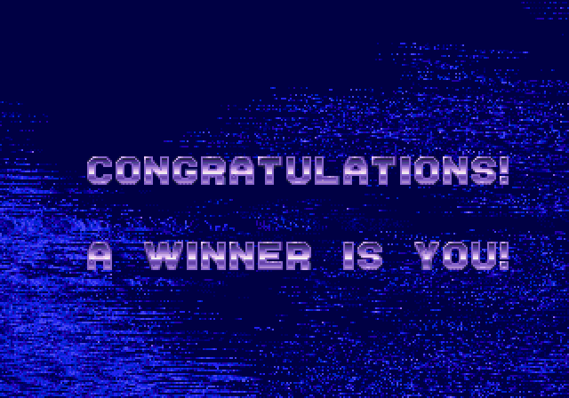

[link back to all posts](https://alxwen711.github.io/blog)

## Jan 1st-15th

Happy new year. 2022 is finally wrapped up, and a full “recap” has been posted on Codeforces [here](https://codeforces.com/blog/entry/111287):

I’ve thought about it and the purpose of this blog now is to further document my progress on CodeForces. Most of my past posts have only been there anyways, although I’ll also recap other contests I will take part in this year, such as Google Code Jam 2023. Anyways enough writing, the journey back to Candidate Master begins now. 

### [Hello 2023](https://codeforces.com/contest/1779)

Problems Solved: A, B, C

New Rating: **1766** (-39)

Performance: **1643**

This contest was mid overall. I made some pretty screwy mistakes but at the same time didn’t exactly have a bad contest. [A](https://codeforces.com/contest/1779/problem/A) was a rare case where I actually took over 10 minutes to solve but I made no wrong submissions. [B](https://codeforces.com/contest/1779/problem/B) had the opposite issue where I submitted quickly but first made the mistake of thinking odd n values were impossible. Then I made the mistake thinking values where n % 4 = 3 were impossible. Turns out only n = 3 is impossible, but the rushing ended up costing me unnecessary lost points. [C](https://codeforces.com/contest/1779/problem/C) was decent, first miss was due to not choosing values to flip greedily. My solution for [D](https://codeforces.com/contest/1779/problem/D) is logically correct, but it turns out trying to use 200000 levels of recursion is not possible. The way I tried to do it was to determine the minimum required blades needed to cut the hair, then see if it was a subset of the given blades. This was done by finding the tallest hair after cut and using that as a starting height. This cut divides the remaining hair into one or more sections that can be solved recursively. The issue is that a haircut like `1 2 3 4 … 200000` would need 200000 layers of recursion, which results in a runtime error on Python since there is a system cap of 1000 layers. This can be averted by adding code to change the recursion limit to 200000, but the added stack space results in the memory limit being exceeded. In actuality I was effectively using recursion here as a stack, so the answer was to refactor my method to be using an array to store sections since pop() is an O(1) operation.
### [Round 842](https://codeforces.com/contest/1768)

Problems Solved: A, B, C, D

New Rating: **1828** (+62)

Performance: **1985**

Welcome to PermutationForces, where for some reason Problems B through E all involve permutations. Not that I’m complaining, I find it impressive that a wide range of topics can be covered with solely permutations. That and I had one of my better contests here. [A](https://codeforces.com/contest/1768/problem/A) though wasn’t really part of this, that was just a funny troll problem where the solution is quite literally in the example testcase. I spent 80% of the time for A confirming my solution was right. Note that `x! + (x-1)! = (x-1)!*(x+1)`, so you can just print x-1 for each case to solve.

[B](https://codeforces.com/contest/1768/problem/B) is a simple greedy problem. I somehow solved this in 3 minutes, which may be a record. [C](https://codeforces.com/contest/1768/problem/C) took longer but the main challenge was in effectively implementing the solution since the ideal scenario would be to assign the “max” value for each spot to one of the two arrays, then the other array would have the highest value it could hold without increasing the maximum, ie. a greedy method for filling in the n ungiven values. 

[D](https://codeforces.com/contest/1768/problem/D) I did very well given the problem difficulty; general idea was to first check if a single inversion pair existed (pretty much basic 1 2 3 4 5 … n permutation, then make a single swap between any two adjacent values). If this didn’t exist, try to create one in the most efficient way possible. Then determine the number of swaps needed to sort the array, and subtract one from this to account for sorting the inversion unintendedly. The number of swaps needed can be counted via the “cycles” in the permutation; assume the array `A` contains a permutation of 1 to n representing n nodes, then A[i] represents a directed edge from node i to node A[i]. If a cycle has length c, it can be fixed with exactly c-1 swaps. The only thing I overlooked in my first attempt was that in fixing these cycles there was a chance I could involuntarily create a single inversion pair, meaning I had a few cases where overcounting by 2 could occur. Checking if any cycle contains two values differing by exactly 1 fixes this bug. 

Sometimes it’s a bit hard to write this concluding sentence due to lack of idea for conclusions. I guess I’ll leave it at this being a solid contest with few errors, and that hopefully I improve over time to be able to have some chance of getting [E](https://codeforces.com/contest/1768/problem/E). All I got was that any permutation could be sorted in at most 3 operations; I then had no clue how to determine how many perumations needed 2 or 3 operations. (0 and 1 were relatively simple to determine.)

### [Educational Round 141](https://codeforces.com/contest/1783)

Problems Solved: A, B, C, D

New Rating: **1901** (+73)

Performance: **2083**

Well then. I actually made it. For a while I thought I did not make it; initial projections had me ending up at a final rating of 1898, which is why there are 25 failed hack attempts for me in this contest. The projection was just a few points off. It also turns out my last 10 contests were all at an Expert level, and 3 of my last 4 were at CM level. I’ve pretty much rediscovered my consistency from back in July and August. 

Overall this was a pretty solid contest; my implementation for [Problem C](https://codeforces.com/contest/1783/problem/C) is correct, but it came close to TLE (~1800ms) so a more optimal implementation is possible. Possibly sorting a list of tuples is slightly faster than sorting a list of lists. [Problem D](https://codeforces.com/contest/1783/problem/D) also involves optimal implementation. My first three failed attempts had the correct solution, but it turns out using an array instead of a dict for the dp method was enough of a difference in time; the small collisions mattered that much. Normally I go against making small adjustments, but this was a TLE on pretest 20, and my hypothesis of having a solution that was almost fast enough turned out to be correct since testcases 18 onwards used maximum input size.

Anyways, I made it to CM. Today is a good day.

### [Round 844 (based on VK Cup)](https://codeforces.com/contest/1782)

Problems Solved: A, B, C, D

New Rating: **1896** (-5)

Performance: **1880**

In young people speak, we call this an “oof lmao”. I actually did pretty well on this contest but a few wrong submissions was the difference between this result and staying in CM. They were not even trivial mistakes; [C](https://codeforces.com/contest/1782/problem/C) I made the first error in choosing to keep letters that were closest to the ideal frequency. What I mean by this is that first I found how many kinds of letters I could have based on the length of the string (divisibility test), then I chose the letters that would be present in the string based on how close their frequency was to n/x, where n is the number of letters in the string and x is the number of unique letters to be in the string. Turns out the right answer can be found by prioritizing letters with the highest initial frequency. 

[D](https://codeforces.com/contest/1782/problem/D) I honestly have no clue how the first few submissions were wrong. My method was to go through each pair of numbers (a,b) and determine all possible values x that make both a+x and b+x squares. After finding all possible values I then try out each one on the whole array and return the most squares found. My scuffed time analysis came out to O(15000n^2) not including the divisor check part, which I also assumed would not be enough to cause TLE since assuming Python does around 20 million operations per second, I’d need about 400000 unique values to test on a 50 value array before this step becomes a problem. I ended up not having any real TLE issues as even the O(15000n^2) step was an overestimate, but instead got a wrong answer on pretest 6. In the contest most of the wrong answer verdicts were on pretest 2, 3, or 5, so this really confused me. What I then did was instead of testing all the potential x values at the end, I tracked how many pairs of values both became squares after adding x. This is an alternate way of tracking how many values can become squares when x is added. For instance, if A+x, B+x, and C+x are squares, then this info is tracked in a dictionary D[x] = 3, and the 3 pairs would be (A,B), (A,C), (B,C). If 4 values became squares then D[x] = 6 since 6 pairs are possible, D[x] = 10 for 5 values, and so on with the triangular values. Inexplicably this resulted in an Accepted verdict, and I still have no clue why. It’s why I delayed getting this post up, as well as attempts on [E](https://codeforces.com/contest/1782/problem/E). E is simple in theory as some experimentation can give a relatively simple algorithm that ends up with the same total area covered as the initial setup, but this is an implementation nightmare. My [intended implementation](https://github.com/alxwen711/contestSubmissionArchive/blob/main/codeforces/live%20contests/2023-1/844/1782e(intended%20idea).py) was to use the rectangles spanning both rows as a range problem, find the gaps left behind, and then solve the top row and bot row rectangles as individual range problems, but this fails due to cases where single row rectangles span past the width of at least one double row rectangle. It’s an improvement in that I at least see how the solution works, but the implementation is absolute hell, even the above idea was one that took longer than the 50 minutes I had left. This may or may not have been partially due to myself waking up a 3:30am for this contest. I simply justify this insanity by the fact that this experience may be needed if I need to go into Round 1C of Google Code Jam, and that it would be a whole week before the next contest I could participate in.

Thus concludes the first two weeks of 2023 on CodeForces. As for current school work I have only 3 courses this term which is a much needed relaxing in pace from the madness that was Winter 2022.


## Jan 16th-31st

### [Educational Round 142](https://codeforces.com/contest/1792) 

Problems Solved: A, B, C, D

New Rating: **1902** (+6)

Performance: **1917**

Truly the “A Winner is You!” moment.

The only problem I had any significant issues with was [Problem C](https://codeforces.com/contest/1792/problem/C). This is a pretty good case where finding just the answer itself is much easier than trying to find the optimal answer, in this case, a minimal sequence of paired values that will result in a sorted permutation. My first idea was based around looking at the first and last values and building from there as a starting point, but there’s a simpler and actually correct method in checking if the middle 2x values are already sorted; if they are then an operation for those values aren’t needed. Answer would then be (# of remaining unsorted values)/2, with a similar idea for odd length arrays.

[Problem D](https://codeforces.com/contest/1792/problem/D) is made significantly easier since each permutation can only go up to 10 values. This then involves some relatively easy hashing to mark what array setups are possible. For instance:

```
Let A = [6,8,1,7,4,3,2,5]
In dictionary D, mark the following as keys: 
“**1*****”
“**1***2*”
“**1**32*”
“**1*432*”
“**1*4325”
“6*1*4325”
“6*174325”
“68174325”
```

For checking the best possible beauty of an array:

```
Let B = [3,4,7,1,8,2,5,6]
If d.get(“***1****”) == None: beauty = 0
If d.get(“***1*2**”) == None: beauty = 1
If d.get(“3**1*2**”) == None: beauty = 2
Repeat as above until…
If d.get(“34718256”) == None: beauty = 7
Beauty = 8 #all cases passed
```

Conveniently, you can just use “0” to represent 10 in this system. Thankfully using strings as keys for dictionaries in Python is significantly harder to hack since the hash function is harder to decipher. And that is how I got to Candidate Master for the 3rd time. There were also Problems A and B, but B was solved in 12 minutes and A in literally 1. More importantly this is the first time I’ve completed A through D in 4 straight contests. Hopefully this means the skill cap on Problem E will be more attainable.

### [Round 846](https://codeforces.com/contest/1780)

Problems Solved: A, ~~C,~~ B, D

~~New Rating: **1837** (-65)~~

~~Performance: **1628**~~

My reaction to still being in Candidate Master after this contest:



My reaction is only marginally sarcastic since I actually did quite well on [Problem D](https://codeforces.com/contest/1780/problem/D) and while I did take a long time to get [Problem B](https://codeforces.com/contest/1780/problem/B), strategically going for [Problem C](https://codeforces.com/contest/1780/problem/C) was the right move in theory. I get back to Problem C since D actually has a very clean solution.

In D we first notice that since n is limited to 10^9, its binary representation can only have at most 30 bits. This almost certainly means that each operation will likely determine at least 1 bit in the final n value. You also need to be sure you don’t subtract too large of a value, so my thought was to subtract powers of two starting from 1. Let’s call the current value being subtracted c. After each substitution, one of two cases can happen:

- The number of 1 bits drops by one: this means the bit subtracted was a 1, i.e. something like  xxxx1 -> xxxx0. Simply add c to the final answer, and multiply c by two to act as a shift.

- The number of 1 bits increases by a (a can be 0): this means the bit subtracted was a 0, i.e. something like xx100 -> xx011. In this case the bit a+1 positions left was a 1, so add 2c^(a+1) to the answer and multiply c by 2^(a+1) to shift the bits

You only have to repeat this v times, where v was the number of 1 bits originally in n to get the answer. Overall I liked this problem, it’s a simple but clever use of bitmasks. Had there been no other issues with this contest, I probably may have actually gained rating since aside from “solving” C before B due to some overthinking I actually had a very clean contest with no wrong submissions.

And then there is C. As of writing this, C has been literally deleted out of existence on the webpage, but here is a quick rundown of the problem:

There are $n$ people invited to a restaurant and $m$ tables in the restaurant. The $i$th person likes dish $a_i (1 <= a_i <= n)$ and the $j$th table seats $b_j (1 <= j <= m, 1 <= b_j <= 2000)$ people. You are to decide which singular dish is served at each table, with the goal being to maximize the number of people eating their preferred dish. 

Each testcase consists of 3 lines. The first line contains $n,m$. The second line contains array $a$ describing the people’s preferred dishes. The third line contains array $b$ describing the seating capacity of each table. There number of seats will always be at least n. Also, $1 <= n,m,a_i,b_j <= 2000$.

My original idea was first to count how many people like each dish and then start placing them based on the largest to smallest table. This was through a greedy method as I would use the largest group of people for the largest remaining table and repeat until everyone has been placed, with the exception being that if a table could seat an exact group, then I would prioritze said group to maximise satisfaction. I.e. if I was seating a table for 3 people and there happened to be exactly 3 people who liked dish 4, then even if a larger group existed, I would seat those 3 people. This meant that for the following testcase:

```
1
11 5
1 1 1 1 1 1 2 2 2 2 2
5 3 3
```

I would return that 11 people could be happy by seating everyone who likes dish 1 at the 3 seat tables and everyone who likes dish 2 at the 2 seat tables. 

[My submission](https://github.com/alxwen711/contestSubmissionArchive/blob/main/codeforces/live%20contests/2023-1/846/c.py)

This is where the crazy begins. It turns out this exact testcase caused a “System Test Fail” for my solution, because the intended “solution” used a similar greedy method without the exact group size rule. At this point it’s pretty clear that the intended solution is completely wrong, hence why this problem and contest was declared null and void. Thing is though that even my current solution would still be wrong on this testcase:

```
1
13 4
1 1 1 1 1 1 1 1 1 2 2 2 2
3 3 3 5
```

The optimal solution would be to seat everyone liking dish 1 at the 3 seat tables and the remaining people at the 5 seat table for 13 happy people, but my program only returns 12.
It turns out, there is no greedy method to solve this problem; the problem itself can be correlated to the [3-partition problem](https://en.wikipedia.org/wiki/3-partition_problem) which is NP-complete. The fact that so many people including myself went for a greedy idea can be attributed to the expectation that Problem C would not be that complicated, but it’s still an avoidable error. I’m lucky that I wasn’t punished for this questionable reasoning.

### [TypeDB Forces 2023](https://codeforces.com/contest/1787) 

Problems Solved: A, B, D

New Rating: **1834** (-68)

Performance: **1619**

And this is what I meant by being lucky. This contest had several things go wrong, mainly Problem B and C. [B](https://codeforces.com/contest/1787/problem/B) wasn’t a complete blunder as my method for using prime factorization and greedily creating `a` values was correct, I just took 30 minutes on this problem from slow implementation. In this case it was more me struggling with finding a way to convert my solution into code rather than being careful. This is most likely just a rare case where I wasn’t able to go fast on this contest as a whole; mentally on this day something felt off. It also felt off on [C](https://codeforces.com/contest/1787/problem/C) since I missed the problem entirely. The intended solution does have dp elements which means that at least I am using the correct technique, but I couldn’t figure it out. [What I came up with](https://codeforces.com/contest/1787/submission/191146506) was splitting each value min-max optimally, then having two setups: one with min value then max value, and the other with max then min value. Then I combined these results in a dp manner. It’s the kind of question where there’s a relatively simple way to solve it, but it’s hard to see at first.

The silver lining of this contest is that it was 3 hours, which was the only reason I still keep my Expert level performance streak. Two minutes shorter and I would not have solved [D](https://codeforces.com/contest/1787/problem/D), which partially took that long due to implementation hell from rushing through my code. It’s actually a very good “graph” problem in that while no graphs are explicitly stated it’s pretty clear that the points can be represented as a directed graph. Much of the implementation issues in my [solution](https://codeforces.com/contest/1787/submission/191162978) come from the `loopback` function used to determine how nodes not on the starting path affect the number of possible values. In past months I’d probably have choked this question away or have not figured out this part of the solution. Instead, I managed to avoid complete collapse and disaster. Alas, the point scale was a bit wack this contest (500-1000-1750-2000), so solving D so late was only enough to move me about 1300 places up to rank 2254, even though top 1300 was attainable with lightning A-C solve. This also makes this the 4th contest that I can technically say “rip CM.” (the 3rd would be Round 846, if C is disregarded then my pace on A,B,D would’ve dropped me.)


Now a quick reflection on current SFU life. It turns out 3 courses are not entirely meant to be “easy”. I thought it would since the drop from 6 to 3 should feel more significant, but 4 was considered a full course load, and the 3 I’m taking aren’t exactly light courses. Even still this month was much needed for a sanity check after the last two months. The co-op process is still in progress and I’ll hopefully be in one for the summer term.


