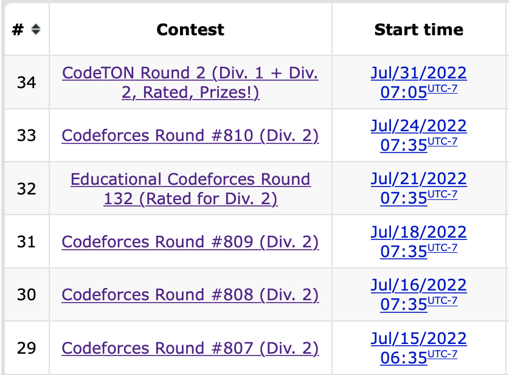
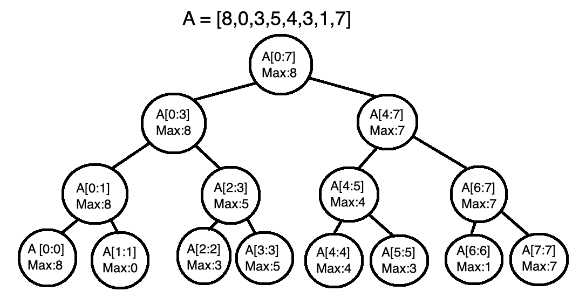
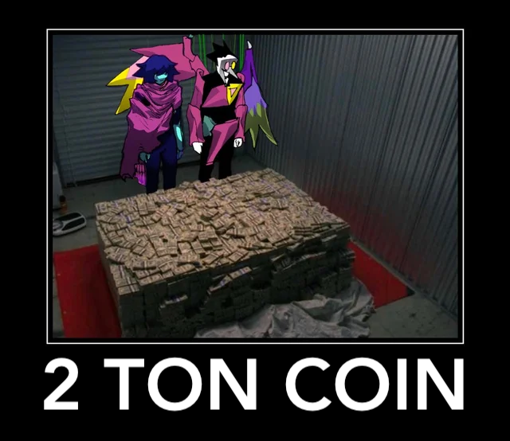

[Link back to all posts](https://alxwen711.github.io/blog)

## July 1st-14th

I’m marking off this first half a day early because next week is a contest fest. 


4 contests in a single week with a fifth one on the 24th. It will be an interesting experiment to see if such an aggressive rate of participation yields results. Before this however we must recap the two contests that occurred in these two weeks:

### [Round 804](https://codeforces.com/contest/1699)

Problems Solved: A, B, C

New rating: **1740** (+32)

Performance: **1828**

Unlike those past two contests I only managed to solve up to [Problem C](https://codeforces.com/contest/1699/problem/C). This was negated by the fact that this contest only had 5 problems. [This comment](https://codeforces.com/blog/entry/104316#comment-927069) best explains why 6 problem contests feel more “fair” than 5 problem contests, but tl;dr is that with only 5 problems, the difficulty curve going from the introductory A and B problems to the “endgame” last problem is steeper since there are only 2 questions to bridge this gap. This usually results in Problems C and D having much lower clear rates to accommodate for the hardest problem being at E instead of F, and this contest was no exception (C and D had 18.6% and 1.5% clear rates respectively). 

This contest was a continuation off the consistency streak I’ve been recently on. If you look at the last 3 contests my performance ratings have been 1794, 1819, and 1828. It also marks my 10th contest in a row with at least a <span style="color:cyan">**Specialist**</span> level performance. It’s nice to finally be out of the whole choking habit I had earlier this year with these contests.

### [Educational Round 131](https://codeforces.com/contest/1701)

Problems Solved: A, B, ~~C~~

New rating: **1639** (-101)

Performance: **1328**

*This contest was a continuation off the consistency streak I’ve been recently on. If you look at the last 3 contests my performance ratings have been 1794, 1819, and 1828. It also marks my 10th contest in a row with at least a <span style="color:cyan">**Specialist**</span> level performance. It’s nice to finally be out of the whole choking habit I had earlier this year with these contests.*

So that previous paragraph lasted for a grand total of 4 days. This is only the second time I have lost over 100 ELO in a single contest, but this time, it doesn’t mentally hurt as badly as it did the first time. This is partially due to having done more contests since that first huge loss to the point that losing rating is something I’m more accustomed to, but it’s more because unlike the first time, where the loss was because of a trivial counting error, this loss came from a genuine error I can learn from.

Problems A and B were not problems as I got through those in ten minutes, quick even for my standards. [Problem C](https://codeforces.com/contest/1701/problem/C) was where the struggles began. It took me 50 minutes to get an accepted verdict here. Since there was only 200000 tasks at most to be completed, I determined that simulating the work process in this question would be a viable solution. Through a creative (albeit slightly ridiculous) use of dictionaries and lists, I could keep track of how many of each kind of task was remaining on each day. This meant that my solution assigned tasks to each worker on each day optimally, thus leading to the correct answer. 

[Problem D](https://codeforces.com/contest/1701/problem/D) was where I faltered. For this question I correctly got the first step in determining the range of values each position in the array could have, but was unable to find a way to create a permutation with these range restrictions. There is one improvement I made over previous contests present in this question: [Here is an earlier submission](https://codeforces.com/contest/1701/submission/163295242) that I made for this question in the contest, compared to a [later one](https://codeforces.com/contest/1701/submission/163299236). The first one ends in a runtime error because I forgot to account for the possibility that in the last for loop constructing the array, the “value” variable would not change if no remaining values for the position could be chosen, which would result in index 99999999998 being “accessed” in an array. This is clearly outside of the array and caused a runtime error, but without finding this, I would not know if my solution was fundamentally wrong or if it was an edge case issue. The revised code confirmed that my method of choosing values for the array was flawed with the wrong answer verdict. Even still, I had made it through the 2 hours with 3 solved problems. Then the system tests happened.

Problem C took 1356ms at most to clear each of the 8 pretests, but on main test #15, the judge ruled my solution as Time Limit Exceeded. This is the first problem I have received a System Test Fail on; this is when you think you have solved a problem based on the pretests, only for the main tests to occur and fail your code. Main test #14 actually cleared in 1996ms, just 4 milliseconds under the time limit, and it seemed at first glance that this was a language issue. I mean, it is well known that Python 3 compared to mainstream competitive programming languages such as C++ and Java is nowhere near as fast.

I would not consider the failure above to be solely because of language choice. Technically, if I coded the exact same solution in another language it might’ve been just fast enough to pass, but [further upsolving](https://codeforces.com/contest/1701/submission/164213557) shows that the main issue is that there was a faster algorithm. A binary search can be used to narrow down the optimal number of days to allocate for the workers to finish the tasks by having the lower boundary start at 1 day and the higher boundary start at 2m days, where m is the number of tasks. This would result in an O(n log n) solution. My original solution was technically an O(n) solution (from personal analysis, I’m not entirely sure on this. It is definitely faster than O(n^2) though), but involves creating up to 200000 dictionary structures. All of the other arrays and linear scans done meant that even though my solution may have been an order faster theoretically, the constant attached to it was so high that the O(n log n) rewrite ended up being about 18 times faster. Amusingly (or tragically), this also meant that my initial solution was *just barely* too slow; after analysing the times taken for each test case in the rewrite, I can conclude that had the time limit been 3 seconds, or even 2.5 seconds, my initial solution would have been fast enough. This question was unironically one of those rare times where micro-optimization would have saved me.

Anyways, I’m writing this on the 15th, and I have Round 806 tomorrow. I’ll recap the results of Codeforces Super Week in the next entry. Also, “Super Week” is a name I made up.


## July 15th-31st

*Note: Please excuse me if there are grammatical errors in this post. It ended up being much longer than expected.*

So anyways,



No point in waiting anymore, here is the recap of the previous SIX contests, five of which took place in a 10 day span.

### [Round 807](https://codeforces.com/contest/1705)

Problems Solved: A, B, C, D

New rating: **1768** (+129)

Performance: **2094**

My results on this contest felt similar to [Round 792](https://codeforces.com/contest/1684), in that I popped off and only had my best overall performance ever in a contest. Solving A through D in under an hour is the main cause of this. [Problem D](https://codeforces.com/contest/1705/problem/D) in particular was a case where for the solution, there was a relatively simple trick to it where given the bit flipping rules, the number of groups of consecutive 1 bits always has to remain the same. This observation meant that solving the problem was actually simpler than expected, even though I literally have no understanding of how the tutorial explains and proves the solution.

My performance in this contest has the following honours going for it:

- Highest ranking ever in a contest (Ranked 251 out of 13633)

- Highest ELO performance ever (2094, only 6 short of <span style="color:orange">**Master**</span> tier performance)

- Fastest A through D solve (also first sub hour A through D solve)

- Highest overall rating post contest ever (1768)

This sort of performance may have been in part to all of the questions conveniently being around my stronger areas, but this was a great start to Super Week. Surely the following contests would see similar or at least comparable success right?

Right?

*Oh no-*

### [Round 808](https://codeforces.com/contest/1708)

Problems Solved: A, B

New rating: **1678** (-90)

Performance: **1372**

*It’s nice to finally be out of the whole choking habit I had earlier this year with these contests.*

Yeah, this statement aged like milk. This entire contest was a mess. I ended up solving B before A, but [Problem C](https://codeforces.com/contest/1708/problem/C) was where everything went to complete pot. Put simply, my mistake was that I kept trying to directly figure out the optimal setup of tests for Doremy to take. After the contest ended, I saw that one of the problem tags was “binary search”.

The whole time I could’ve just binary searched to find the maximum number of tests Doremy could take and then output any solution containing that many tests, instead of trying to directly figure out the optimal number of tests to take. I basically fell into the same trap as I did in Educational Round 131. Let’s just move on to the next contest.

### [Round 809](https://codeforces.com/contest/1706)

Problems Solved: A, B, C

New rating: **1670** (-8)

Performance: **1647**

This contest might have won the award for “most average contest performance” so far, because the only interesting thing that occurred was that I solved [Problem C](https://codeforces.com/contest/1706/problem/C) before [Problem B](https://codeforces.com/contest/1706/problem/B). Both problems had a similar method where a greedy method could be used to narrow down the problem into a handful of potential “optimal” solutions; in B’s case, it is focusing on only a single colour of block, and for C’s case, if n is even, there are only two ways for there to be n/2-1 cool buildings. I just happened to figure out the greedy solution for C first, which isn’t surprising since it was only worth 1250 points compared to B’s 1000, meaning that it wasn’t meant to be much harder. [Problem D1](https://codeforces.com/contest/1706/problem/D1) was a problem where I could not see the solution at all. The furthest I got was figuring out the minimum and maximum values possible for each element. That said, one of the tags for this problem was AGAIN “binary search”, meaning that in the last 4 contests, I lost rating in 3 of them due to binary search. Aside from Round 807, Super Week is not looking great right now.

### [Educational Round 132](https://codeforces.com/contest/1709)

Problems Solved: A, B, D

New rating: **1667** (-3)

Performance: **1655**

I don’t care that I lost rating. I did very well on this contest. [Problem A](https://codeforces.com/contest/1709/problem/A) was quite trivial, but [Problem B](https://codeforces.com/contest/1709/problem/B) is a good introductory dp problem. [Problem C](https://codeforces.com/contest/1709/problem/C) actually had fewer solves in contest compared to [Problem D](https://codeforces.com/contest/1709/problem/D), even though mechanically it is simpler. It’s understandable that I missed this question about brackets since the entire difficulty with C was realizing that there actually exists a greedy solution, which I would have never figured out.

Problem D is the sole reason why I’m proud of how I did in this contest. The easy part is determining if the robot can reach the finish cell or not. There are only 2 ways a robot that travels k tiles at a time in a single direction cannot reach the finish cell:

1. The horizontal distance or vertical distance between the start and finish is not a multiple of k

2. There exists a column between the start and finish that the robot cannot pass through due to having too many cells blocked off.

The second condition is a bit trickier, but the simplest way to calculate this is to find the maximum number of cells blocked in a column in between the start and finish values which involves finding the maximum in a subarray. Checking if the robot can pass through the maximally blocked column is done by finding how far upwards can the robot move. This means that the only part left unsolved in this question is finding the maximum of a subarray, which happens to be the hard part of the question.

If I only had to deal with 1 query asking if the robot can travel between two arbitrary cells, then this would not be Problem D. For Problem D, there are up to 200000 queries each with different paths to determine for the robot, meaning that I would have to determine 200000 subarray maximums for a given array. Something trivial like max(A[i:j]) would be unfeasible since for n queries and an array of length x, the worst case runtime would be O(nx). X’s maximum value is also 200000, so linear time for each query effectively results in an O(n^2) runtime for the problem when I needed at minimum O(n log n). So there has to be a way to determine a subarray’s maximum value in O(log n) time, with at most O(n log n) preparation.

This resulted in myself creating something known as a segment tree. Below is a visual example explained in this paragraph. The maximum value of a subarray with a single element is trivial, so n nodes can be created for an array A of n elements with each node holding the information that A[i:i], 0 <= i < n, has a maximum of A[i]. From there, parent nodes can be created for adjacent subarrays. The value stored for the ranges these parents nodes cover is the larger of the two maximums from its children. The process continues until a final parent node covering the entire array is created. This results in a binary tree containing various subarray ranges alongside their maximum values. To find the maximum value in any subarray, the tree can be traversed using a binary search-like method to obtain subarray segments that make up the full subarray.



The segment tree can be set up in O(n) time (2n nodes are created) and it allows me to find the maximum of any subarray in O(log n) time. This meant for n queries, my program could now take only O(n log n) time to run. Even still, there were a few more challenges. [My first accurate implementation](https://codeforces.com/contest/1709/submission/165197822) TLEd because for creating the segment tree, I was using an array to store nodes in a queue structure. To dequeue nodes, I called nodes.pop(0) (array name is nodes) but for Python, the pop() command only takes constant time if the last element in an array is being removed. Otherwise, pop() will take linear time, meaning that my queue setup was making the setup of the segment tree take O(n^2) time. [My final submission](https://codeforces.com/contest/1709/submission/165203755) resolved this issue with a different queue setup, but you may notice that I received 3 accepted verdicts for this question. The first accepted version took 1949ms to run, and the time limit is 2 seconds. This was more due to how I implemented the solution since there were other Python solutions that finished in under a second, but it doesn’t hide the fact that this was very concerning not just because the solution had not run on main tests yet, but also because this is an Educational Round, meaning that after the contest, there would be a 12-hour period where anyone could try to hack my solution with their own testcases. After some adjustments, my final submission completed pretests in about 1800ms. Amusingly, all three submissions would be *just barely* fast enough to pass all the main tests, taking over 1900ms each.

Oh, and I haven’t even mentioned this yet:


As if the near TLE shenanigans weren’t enough for my blood pressure, a total of **16** attempts from 5 different people were made to break my solution. AND my solution defended all of them successfully. Just about every attempt made was to try and make my solution exceed the time limit, and the closest any of them got was about 882ms. If anyone who tried hacking my solution is reading this, then to you specifically, thank you for trying to hack me, defending all of the hacking attempts actually felt good. That said, given how a segment tree works, there may be a very specific testcase that could cause a TLE. (I only thought of the potential case on August 3rd.). Either way, the fact that I actually used a tree to solve a problem for the first time combined with the whole hacking saga caps off the most glorious loss of 3 ELO. Despite the “loss”, I definitely felt much more confident going into the next contest in Super Week. Little did I know the absolute chaos that would result from that contest.

### [Round 810](https://codeforces.com/contest/1711)

Problems Solved: A, B, C

New rating: **1748** (+81)

Performance: **1952**

[Blog post](https://codeforces.com/blog/entry/105129#comments)

This is a unique case where only the blog post for this round could really explain part of what happened in this contest, because while I did put up a statistically impressive performance, this was partially due to this being a SpeedForces contest. There was supposed to be 6 problems in this contest, but one of the problems was removed for unknown reasons. My theory is that the original Problem D for the Division 2 contest was removed, and that Problems E and F were moved to the D and E positions. This is based on the fact that [Problem C](https://codeforces.com/contest/1711/problem/C) was solved 2891 times in the contest while [Problem D](https://codeforces.com/contest/1711/problem/D) only had 53 solves. Compounding this was that I found C to have a relatively simple solution (which involves painting the area with stripes of at least two tiles wide) while having no idea how to even start D. Overall I did well here to conclude Super Week, but it feels overshadowed by how scuffed this contest was. I didn’t even mention the mess with Division 1, which is better off explained by the blog post.

### [CodeTON Round 2](https://codeforces.com/contest/1704)

Problems Solved: A, B, C, D

New rating: **1863** (+115)

Performance: **2170**



Please excuse me as I lord over the fact that 650th place earned me about 2 dollars worth of cryptocurrency. Yes, luck did play a bit of a role in this success since all of the problems I solved were relatively easy greedy or math problems, but solving A through D in 40 minutes is my fastest pace yet. [Problem D](https://codeforces.com/contest/1704/problem/D) in particular has a surprisingly simple solution. For each array, determine it’s “score” as follows:

```
[a,b,c,d,e] -> a*0+b*1+c*2+d*3+e*4
[3,6,1,0,2] -> 3*0+6*1+1*2+0*3+2*4 = 16
[0,1,2,3,4] -> 0*0+1*1+2*2+3*3+4*4 = 30
```

Using this score metric, we can make an important revelation: No matter how many times Operation 1 is used on an array, its score will remain the same, whereas every time Operation 2 is used, the array’s score increases by 1. Thus if we calculate the score for each array given, one will have a score x higher than the rest to represent the x times Operation 2 was used on it.

I wouldn’t say this was the hardest problem I’ve ever solved, but the overall success on the other three problems helped to make this my first ever <span style="color:orange">**Master**</span> level performance. Combine this with smashing my previous all time overall ELO high by nearly 100 points, and I’m now within actual striking range of reaching <span style="color:purple">**Candidate Master**</span> (1900 ELO) in my next contest. [I’ve graphed out the relationship between ELO change and ELO difference from expected performance after each contest here](https://www.desmos.com/calculator/1uzr6qbblz), and I estimate that if I perform at minimum a 1997 ELO level in my next contest, I will be eligible for some Division 1 contests. To further help me on this endeavour that will begin on August 4th with Educational Round 133, I have begun a [Python repository for competitive programming](https://github.com/alxwen711/py-competitive-library). It’s a WIP project intended to provide useful templates for algorithms, data structures, and other useful files for competitive programming in Python. After all, the main objective of this blog is to log my Codeforces progression since the start of this year, and to show that Python is actually viable in competitive programming.


