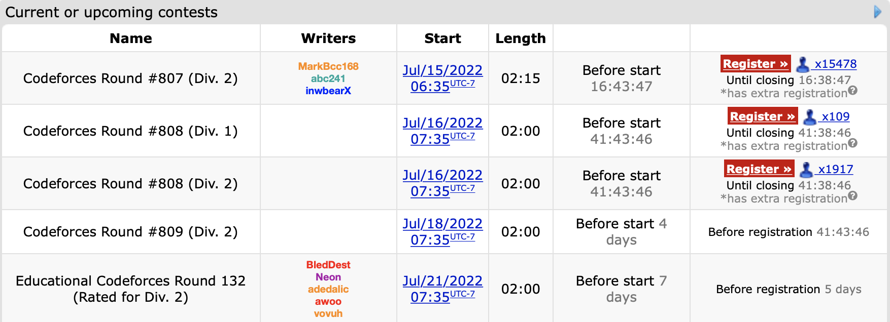

## July 1st-14th

I’m marking off this first half a day early because next week is a contest fest. 

4 contests in a single week with a fifth one on the 24th. It will be an interesting experiment to see if such an aggressive rate of participation yields results. Before this however we must recap the two contests that occurred in these two weeks:

### [Round 804](https://codeforces.com/contest/1699)

Problems Solved: A, B, C

New rating: **1740** (+32)

Performance: **1828**

Unlike those past two contests I only managed to solve up to [Problem C](https://codeforces.com/contest/1699/problem/C). This was negated by the fact that this contest only had 5 problems. [This comment](https://codeforces.com/blog/entry/104316#comment-927069) best explains why 6 problem contests feel more “fair” than 5 problem contests, but tl;dr is that with only 5 problems, the difficulty curve going from the introductory A and B problems to the “endgame” last problem is steeper since there are only 2 questions to bridge this gap. This usually results in Problems C and D having much lower clear rates to accommodate for the hardest problem being at E instead of F, and this contest was no exception (C and D had 18.6% and 1.5% clear rates respectively). 

This contest was a continuation off the consistency streak I’ve been recently on. If you look at the last 3 contests my performance ratings have been 1794, 1819, and 1828. It also marks my 10th contest in a row with at least a **Specialist** level performance. It’s nice to finally be out of the whole choking habit I had earlier this year with these contests.

### [Educational Round 131](https://codeforces.com/contest/1701)

Problems Solved: A, B ~~, C~~

New rating: **1639** (-101)

Performance: **1328**

*This contest was a continuation off the consistency streak I’ve been recently on. If you look at the last 3 contests my performance ratings have been 1794, 1819, and 1828. It also marks my 10th contest in a row with at least a **Specialist** level performance. It’s nice to finally be out of the whole choking habit I had earlier this year with these contests.*

So that previous paragraph lasted for a grand total of 4 days. This is only the second time I have lost over 100 ELO in a single contest, but this time, it doesn’t mentally hurt as badly as it did the first time. This is partially due to having done more contests since that first huge loss to the point that losing rating is something I’m more accustomed to, but it’s more because unlike the first time, where the loss was because of a trivial counting error, this loss came from a genuine error I can learn from.

Problems A and B were not problems as I got through those in ten minutes, quick even for my standards. [Problem C](https://codeforces.com/contest/1701/problem/C) was where the struggles began. It took me 50 minutes to get an accepted verdict here. Since there was only 200000 tasks at most to be completed, I determined that simulating the work process in this question would be a viable solution. Through a creative (albeit slightly ridiculous) use of dictionaries and lists, I could keep track of how many of each kind of task was remaining on each day. This meant that my solution assigned tasks to each worker on each day optimally, thus leading to the correct answer. 

[Problem D](https://codeforces.com/contest/1701/problem/D) was where I faltered. For this question I correctly got the first step in determining the range of values each position in the array could have, but was unable to find a way to create a permutation with these range restrictions. There is one improvement I made over previous contests present in this question: [Here is an earlier submission](https://codeforces.com/contest/1701/submission/163295242) that I made for this question in the contest, compared to a [later one](https://codeforces.com/contest/1701/submission/163299236). The first one ends in a runtime error because I forgot to account for the possibility that in the last for loop constructing the array, the “value” variable would not change if no remaining values for the position could be chosen, which would result in index 99999999998 being “accessed” in an array. This is clearly outside of the array and caused a runtime error, but without finding this, I would not know if my solution was fundamentally wrong or if it was an edge case issue. The revised code confirmed that my method of choosing values for the array was flawed with the wrong answer verdict. Even still, I had made it through the 2 hours with 3 solved problems. Then the system tests happened.

Problem C took 1356ms at most to clear each of the 8 pretests, but on main test #15, the judge ruled my solution as Time Limit Exceeded. This is the first problem I have received a System Test Fail on; this is when you think you have solved a problem based on the pretests, only for the main tests to occur and fail your code. Main test #14 actually cleared in 1996ms, just 4 milliseconds under the time limit, and it seemed at first glance that this was a language issue. I mean, it is well known that Python 3 compared to mainstream competitive programming languages such as C++ and Java is nowhere near as fast.

I would not consider the failure above to be solely because of language choice. Technically, if I coded the exact same solution in another language it might’ve been just fast enough to pass, but [further upsolving](https://codeforces.com/contest/1701/submission/164213557) shows that the main issue is that there was a faster algorithm. A binary search can be used to narrow down the optimal number of days to allocate for the workers to finish the tasks by having the lower boundary start at 1 day and the higher boundary start at 2m days, where m is the number of tasks. This would result in an O(n log n) solution. My original solution was technically an O(n) solution (from personal analysis, I’m not entirely sure on this. It is definitely faster than O(n^2) though), but involves creating up to 200000 dictionary structures. All of the other arrays and linear scans done meant that even though my solution may have been an order faster theoretically, the constant attached to it was so high that the O(n log n) rewrite ended up being about 18 times faster. Amusingly (or tragically), this also meant that my initial solution was *just barely* too slow; after analysing the times taken for each test case in the rewrite, I can conclude that had the time limit been 3 seconds, or even 2.5 seconds, my initial solution would have been fast enough. This question was unironically one of those rare times where micro-optimization would have saved me.

Anyways, I’m writing this on the 15th, and I have Round 806 tomorrow. I’ll recap the results of Codeforces Super Week in the next entry. Also, “Super Week” is a name I made up.

## July 15th-31st

