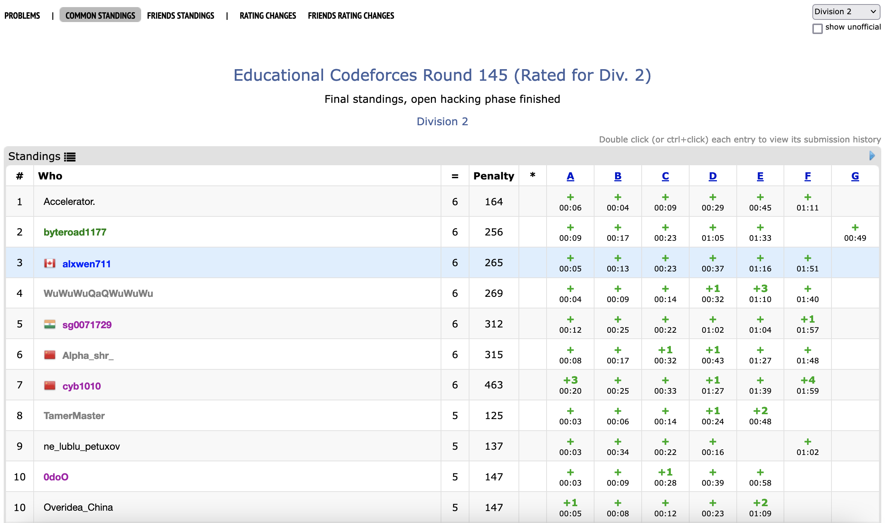

[link back to all posts](https://alxwen711.github.io/blog)

## March 1st-15th

Currently not listed in this very high quality recap of recent CodeForces contests is that each week I am doing a practice ICPC contest. It’s more of a personal thing so they won’t be getting full recaps here, but I’ll use this space to document current progress. After the disasterclass that was ICPC Pacific Northwest 2022, I started off with the 2015 Pacific Northwest Div 2 contest to gauge where I’m at. It turns out a 2 star Codeforces Gym is a bit too easy for me since I got all of the questions right in 3 hours. Now I’m working on 3 star level practice, which is more suitable for my level. Ideally before October I’m consistently hitting 7-8 problems on 4 star level contests which should be the approximate level of the 2023 regional.

### [Round 856](https://codeforces.com/contest/1794)

Problems Solved: A, B, C

New Rating: **1829** (-20)

Performance: **1766** 

Congratulations: It’s more mid. Except this time, I ended in mediocrity in a funny way by screwing up [A](https://codeforces.com/contest/1794/problem/A) twice. I suspect what happened was that my reverse string method may have also been detecting substrings accidentally. For future contests it may be just best to not be overly reliant on fancy string indexing shenanigans when there are much simpler solutions possible. This random 100 point loss is rectified by myself solving [B] (https://codeforces.com/contest/1794/problem/B) and [C](https://codeforces.com/contest/1794/problem/C) in 14 minutes, but it still does not help my problem of not being able to solve [D](https://codeforces.com/contest/1794/problem/D). I would say that I made actual progress here but I felt genuinely stuck. Put simply, code libraries don’t really matter when you have no clue how to calculate the combinatorial problem.

This recap may seem short, but all I could discuss was me trolling A, ransacking B and C for being easy problems, or talking about what little progress I made on D. Maybe I’ll have more use out of recapping my ICPC practice contests that I’m doing weekly now.

### [Nebius Welcome Round](https://codeforces.com/contest/1804)

Problems Solved: A, B, C, D

New Rating: ~~**1900** (+71)~~ **1899** (+70)

Performance: ~~**2083**~~ **2080** 

Curse you cheaters. I was actually about to celebrate reaching CM from this contest. I thought that the plagiarism checks if anything, would increase my rating gain because it’s expected that cheaters do well on the contest. It turns out that there were enough cheaters that placed below me that my overall rating gain ended up decreasing. I would do the whole essay and condemnation here on why cheating hurts not just the cheaters themselves but the entire competitive programming community as a whole, but there are enough articles on the Internet about this and I doubt that another one here would change many cheater’s minds. That said, just wow. If you were one of those cheaters, I don’t know whether to be feeling disappointed, mockery, or nothing at all. You not just cheated, you cheated in a contest an actual company was using for finding legitimate candidates. Not only that, a lot you didn’t even cheat properly. Some people cheated for a virtual rating or title on the Internet thinking that it would bring respect or accomplishment. It maybe works since our world tends to be quite shallow when looking at surface level accomplishments. Still does not change the fact that it’s quite pathetic one would go through such fraudulent measures for the appearance of mediocre accomplishment. 

With that minor rant out of the way, this was actually a good contest for me. [B](https://codeforces.com/contest/1804/problem/B) felt slightly harder than [C](https://codeforces.com/contest/1804/problem/C) which is understandable since they both had the same point value, but more importantly, I actually solved a [D](https://codeforces.com/contest/1804/problem/D) problem again. My process for finding minimums is very simple and accurate; just assign 2 window rooms to as many “11”’s as possible. For maximums, it’s the exact inverse, place 2 window rooms anywhere except “11”’s. My first 3 attempts thought there was a difference in priority between “01”/”10” and “00” pairs, but turns out that this causes an incorrect answer given a specific setup. This contest as a whole feels like one where in a rare occurrence, I did not shoot myself in the foot. There was a bit of progress made on [E](https://codeforces.com/contest/1804/problem/E) as well; The solution involves checking between each of the 2**n possible groups of nodes if a cycle exists between them, and if it does, does this cycle and its neighbouring nodes consist the full graph. The issue is that determining if a cycle exists between x given nodes in a graph of n nodes is a bit complicated.


## March 16th-31st


*This week, on a very special episode of **Days of Our Programmers,***

_A critical contest faces our protagonist. In the weeks following the Collegiate Holistic Algorithm Trials in the Great Pacific Territories of 2022, the Proponent of Python has continued his infinite ordeal to the holy shrine of a purple username. This never ending battle against the glory of 1900 virtual rating points  has begun to show cracks in the Dragon's armour. His ability on the more difficult problems exists in the same dimension where Python is faster than C. There have been slight accidents in recent competitions that were saved by surprising attentiveness and plain honest luck. But there is no denying for once on Codeforces, our Protagonist has been consistent. He has completed 19 competitions in a row without a serious implosion, with the last bringing him right to the doorstep of his grand treasure._ This is quite literal in the sense that the Dragon is literally 1 ELO point away from Candidate Master. _It could've happened last round, but our Protagonist has a reason why this didn't happen: cheaters. He believes that enough cheaters did worse than him in a contest so that when they were removed from the rankings, the ELO recalculations caused him to gain 1 point less than expected. A truly impenetrable conclusion of logic if we ignore the 3 wrong submissions on Problem D._

_That trifling is in the past though. The Proponent of Python is prepared. Round 858 looks to be a great addition to this **group of twenty**, and it will be the final push on this adventure. And so, 5 am strikes. It is the crack of dawn. And the Dragon dives head first into Round 858 (https://codeforces.com/contest/1806). Problem A (https://codeforces.com/contest/1806/problem/A): a trivial problem of greed. No hesitation. Through the powers of Pythonic implementation, it falls in three minutes. On to Problem B (https://codeforces.com/contest/1806/problem/B): It’s an old CodeForces favourite in the constructive algorithm challenge. Even more so since the writers of this problem may have been enjoying some tacos and enchiladas while writing this question since it’s an array problem where MEX is involved. Coming back from this digression, the Protagonist deciphers a dubious greedy idea, and submits his first attempt._

_Unfortunate. It is a `wrong answer on pretest 2`. In fairness the Proponent’s first idea was dubiously implemented. He is only certain that the only the frequency of each value in the array is important to this question. A second attempt (https://codeforces.com/contest/1806/submission/197919722) is made with more careful thought to lead to_ another `wrong answer on pretest 2`? Huh. It’s odd because the values in the array can range from 0 to 200000, so there should not be any problem with using a simple array to store the frequencies of each value. All you need to do is set h[x] to be the frequency of value x in the array, nothing too complicated.

_In this arbitrary struggle with a problem that will inevitably be rated 900 after this competition, tension begins to amplify as thousands of other competitors are solving B. With this the Dragon acts decisively: Problem B will be skipped for now. And thus we come to the third problem (https://codeforces.com/contest/1806/problem/C). And it turns out a new problem emerges here: according to completely factual information about dragons, they tend to not be very good at reading. Sure they may have magic powers allowing them to pull incredible feats of luck out of questionable language choices but it turns out that being a large winged reptile does not allow for enhanced comprehension of text. And now our protagonist has a struggle: Problem C uses an impressively exotic lexicon for explanation. Such complex terminology is used such as the `subsequence`, and the `distance between two arrays`. Our protagonist then burns 35 minutes on this question to come to an incredible revelation. He has determined the optimal solution for the third example in the first test case. The array `[-2,-2,2,2]` can be made into the good array [-2,-1,-1,3] which is only a distance of 5 away, the optimal value. Just ignore the fact that a subsequence does not have to consist of contiguous values and that our protagonist only figured this out after asking the contest organisers. Nearly 2 hours into the contest. Truly an example of draconic literacy clairvoyance._

_Alas our protagonist cannot determine an optimal solution for the fourth case in the example. So now nearly an hour has passed and only 1 problem is solved. Back to B we go. Then another revelation was made. The struggles with Anglo-Saxon explanation in Problem C are a mere pronunciation error._

_The Dragon misread `Runtime error on pretest 2` as `Wrong answer on pretest 2`. His first two submissions were not of algorithmic flaw, but implementation flaw._

_This changes everything. Struggles to find a flaw in reasoning are nullified as the flaw may have been in the code itself. Panic ensues. But where could it be? Desperate fixing attempts cause a third runtime error. What could possibly be wrong? The values are just 0 to 200000. I’m tracking the values in array h which… oh. `h = [0]*min(n+1,200001)`, where n is the number of values in the array._ If we can excuse the narrator for a moment to explain what happened here, basically an array like `[20000,20000]` would have 2 values, thus h would be initialised as `[0,0,0]`. The frequency tracking algorithm would increase `h[20000]` to 2. You can probably tell that would be a problem. As for how this error occurred, err… let’s just say if I had a reasonable explanation why, this episode would not be being thrown here.

_That should be the end of the great monster that is Problem B. Just initialise each of the 10000 possible test cases with an array of length 200001 for frequency tracking. Only about 2 billion values being initialised, it won’t be victimised by the TLE bug. The protagonist regrettably actually tried this. It was as effective as this incredibly forced comparison of the Proponent’s current contest so far being about as successful as the Denver Broncos offence in 2022. If you somehow get that reference then just know that this is why I don’t follow the NFL anymore._

_The writer of this shitpost finally has great news that at least, the discussion of Problem B is over. It turned out only tracking the number of 0’s and 1’s in the array was necessary, and thus this infinite struggle is finally over-_

`Wrong answer on pretest 2`

```python
h = [0,0]
for i in range(n):
    if ar[i] == 0: h[0] += 1
    elif ar[i] == 0: h[1] += 1
```

Oh for the love of-

*PLEASE STAND BY…*

Okay I’m finally back. Let’s just end this mess of an episode.

_At long last after an hour and 5 failed attempts, the Dragon conquers problem B. The contest still goes on for another hour, but it would not be until 10 minutes until the end that through draconic clairvoyance, our protagonist finally understands problem C. And thus a catastrophic end has been reached. The Proponent has drowned in the midpack. The contest signifies an entrance for our protagonist into an elite group of twenty. That is, the top 20 competitors sorted by rating loss. Negative 173 ELO. From 1 point away to 174. There is failure, and then there is this. It is now schadenfreude. Death by draconic illiteracy and C ultimately being an ad-hoc problem, a typical strength. 19 straight contests had went and gone with at minimum Expert level performance, and now we have this. That contest before our protagonist’s consistency streak? Pinely Round 1, the contest that drove him into the hell of being “Special”. He’s not back there yet but we only hope for reasons of sanity he does not revisit that cursed land. Else a greater curse may unfold into this Discord Server in the name of ***Days of Our Programmers.***_

### [Round 858](https://codeforces.com/contest/1806)

Problems Solved: A, B

New Rating: **1726** (-173)

Performance: **not worth mentioning (857)**

I already recapped this contest in the above episode/rant. I would normally give a more proper explanation to what went wrong here, but at least with Educational Round 123, it was just one unfortunate case of not being able to count to five. Whatever I say to explain how this catastrophe occurred will only make me look more like an idiot.

### [Educational Round 145](https://codeforces.com/contest/1809)

Problems Solved: A, B, C, D, E, F

New Rating: **2062** (+335)

Performance: **2926**




Let’s just go back to [August last year](https://alxwen711.github.io/blog/Aug22) for a moment. In the second half of this month, in my efforts to reach Candidate Master before the school year started, I participated in [Round 814](https://codeforces.com/contest/1719). In that contest I solved “6” problems (technically 5 because D was split into 2 subproblems) and had an incredible International Master level performance (perf=2363). The hardest problem I solved was [Fibonacci Strings](https://codeforces.com/contest/1719/problem/E), a 2000 rated problem mainly based on a greedy method and number theory, my two strongest concepts. In that contest I placed 39th out of 14823 participants rated up to 1899 ELO.

With this contest, pretty much any record I set in Round 814 was not just broken, but pretty much all but destroyed. I mean, third out of 14329 official Div 2 participants. My first [F](https://codeforces.com/contest/1809/problem/F) solve. Solving a 2400-rated and 2500-rated problem in contest when my previous peak was 2000. Three freaking hundred thirty five elo gain.

This, at least for the time being, is my magnum opus.

<details>
<summary>[Problem E](https://codeforces.com/contest/1809/problem/E) thoughts</summary>

I’m highlighting this problem in particular as it felt like the most difficult of the ones I solved. The premise is simple enough: you’re given two water tanks able to hold _A_ and _B_ litres of water respectively. Given n operations where some amount of water is moved from one bucket to the other, you have to determine how many litres of water will remain in bucket A after the operations. This has to be calculated for EVERY initial starting state for the buckets, and there are additional rules for if there isn’t enough water to complete an operation or doing so would cause a bucket to overflow. By every initial state, in an example where both buckets could hold up to 2 litres of water, the possible starting states would be `(0,0),(0,1),(0,2),(1,0),(1,1),(1,2),(2,0),(2,1),(2,2)`

There are several observations needed to solve this problem. Trivially you could simulate every possible starting state, but with up to 10000 operations and each bucket holding up to 1000 litres each, this is 10^10 operations, which isn’t possible. To make this more efficient, there is the first observation that the amount of water in both buckets combined will never change. Furthermore, consider two states of (3,1) and (2,2), where the buckets can hold 4 and 2 litres respectively. If we try moving a litre from bucket A to B, both of these states end up as (1,3) and can be treated as equal. Furthermore, a state like (4,0) would move to (3,1), and would be only a litre away from the prior (3,1) state in difference.

What I’m trying to explain here is that it is possible to calculate the results for any amount of starting water in the two buckets combined in a single simulation, as it is representable as a segment. You would need to keep track of which states are considered identical after a certain number of operations, and any state that allows all the operations to be completed in full can be calculated by referring to the compressed endpoints. With my solution I expressed each of the 2001 subproblems (number of possible sums of litres in the 2 buckets) as a segment range, where the left endpoint consists of the maximum possible amount of water in bucket A, and right endpoint being max amount of water in B. This is also where code readability was actually helpful to sort out my though process; particularly having each subproblem solved through creating a class object helped greatly. Code readability itself is one of the skills lesser talked about in competitive programming; in actual practice I’d place more comments but even from looking at my code it’s surprisingly simple to tell what is going on.
</details>

<details>
<summary>A few other solution thoughts on [Problem F](https://codeforces.com/contest/1809/problem/F)</summary>
A [harder version](https://www.ioi-jp.org/joi/2020/2021-ho/2021-ho-t5-en.pdf) of this problem appeared in the 2020 Japan Olympiad in Informatics where `bi`, the cost per unit of energy/litre of fuel could be from 1 to 200000. I figure that my dp idea could extend to solve this variation but the fact that `bi` in this problem could only be 1 or 2 makes it much easier.

The fuel buying strategy is simple: If you are at a city where gas costs only 1 unit, then buy as much fuel as you can or just enough to complete the cycle. Otherwise, buy only enough fuel to reach the next city. This logic also means that starting on any 1 cost city will yield the same minimum cycle cost. You can then compute the cost of any partial loop where the start is a  1 cost city by manually calculating the cost required to reach each city in a cycle and doing some funny segment arithmetic (stuff like cost of travelling first 10 cities - cost of travelling first 5 cities if finding cost of going from city 6 to 10). Then for each 2 cost city the cost is simply the distance to the next 1 cost city\*2 + the cost from that 1 cost city to the end of the cycle. Using some dp techniques to find the closest 1-city for each 2-city and costs in general this can be completed in O(n).

</details>

If this is the sort of level I can perform at in October, then I’m pretty confident we’ll do much better. There is the caveat here that there were no graph problems to screw with me, but this contest was flat out magical. I cannot think of a single thing I did wrong in this contest, which is a rarity in itself with how cynical I tend to be on bad contests. This contest also somehow places me in reasonable striking distance of reaching Master. It would require another insane breakout performance (~2250+) but I did just complete a contest at an IGM level, so miracles can happen.

### [Round 860](https://codeforces.com/contest/1798)

Problems Solved: A, B, C, D

New Rating: **2080** (+18)

Performance: **2126**

To be fair, I’d have a better chance of using Haskell in one of these contests than actually matching my previous masterpiece, but I definitely tried and this was still a very good contest. 4th highest overall performance is not something to overlook. A through D were all completed in under an hour which is always a good result; with [D](https://codeforces.com/contest/1798/problem/D) in particular, I made good use of greedy reasoning. Less noted in these results is that I got A through D with 0 wrong submissions, which is always good for speed and consistency purposes.

This was also a contest where I had serious chances on [E](https://codeforces.com/contest/1798/problem/E). I may have failed deep in the 3rd test case because there is likely something I’m not considering, but unlike past E problems, I didn’t look completely hopeless on this problem. I actually wrote up a somewhat reasonable sounding solution.

<details>
<summary> Drafted solution on Problem E, still unsure where the error is</summary>
The first important observation is that the f value for any subarray will be 0, 1, or 2.

0 implies that the subarray is already a multiset.

1 implies that the subarray can be fixed with exactly 1 change (will come back to this later)

2 changes can always make a subarray a valid multiset. For a subarray of n values, just set the first two elements to 1 and n-2 to make it valid.

For the given array, determine if each subarray consists of only valid sets and define this as the h value. For instance, `[2,3,1,0,1,3]` is valid and consists of 3 sets `[2,3,1], [0], and [1,3]`. If the subarray is not valid then its h value is 0. Repeat this with all suffixes of the array except the 1 element one. For instance, the top row contains an example array, and the middle row contains each element’s h value, and the bottom row each element’s f value:

```
3 4 1 2 1 7 7 3 1 3 1 2 1 1 4 2 7 1 1
4 3 4 3 3 0 2 3 4 0 3 2 2 0 1 0 0 1 0
0 0 1 1 1 1 1 1 1 0 1 0 1 0 2 1 1 1
```

A diagonal pattern can be noticed. Letting A be the array with the main array values, H be the array with the h values, and F be the array with the F values:

If A[i] == H[i+1], F[i] = 0
Else if A[i] = 1 or H[i+1] != 0, F[i] = 1
Else if max(H[i+1:])+1 >= A[i], F[i] = 1
Else, F[i] = 2

The 2nd last case is a bit complicated, as it’s obvious how 1 operation can used to create 1 set or adjust A[i] to the correct number of sets, but a simple usage of this case is shown by the array `[2,7,1,1]`. Only 1 operation is needed as the 7 can be changed to a 0 to make 2 valid sets.
</details>

Thus concludes possibly the most chaotic run of 3 contests I have competed in. This log should’ve been up about a month ago but for some reason I thought CodeTON Round 4 was part of March (it isn’t), and I’ve been recently caught up in many school related things, mainly finals and figuring out my plan for the summer. At the moment the co-op potential for the summer term is lightly put, not exactly great, but the important part is that I always have something meaningful to improve myself. I’ll detail more in the April update of this journal though since this post really needs to get up now.

