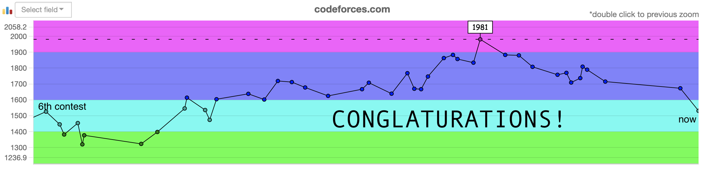
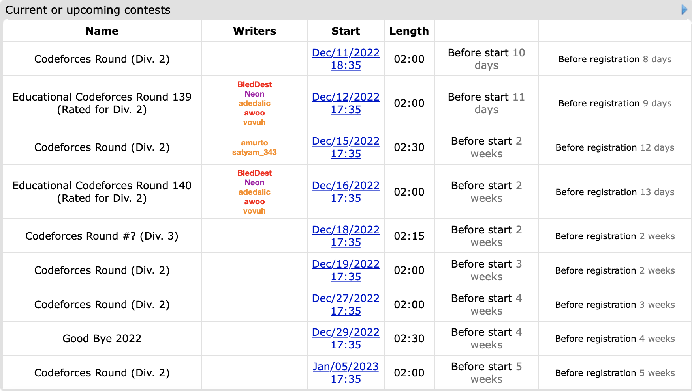

[link back to all posts](https://alxwen711.github.io/blog)

## November 1st-15th

Welcome back to a regularly scheduled recap of my CodeForces contest shenanigans. I may not have much time for actual practice due to school being extremely heavy right now, but with how much I’ve tanked the last 10 contests, I can’t really go much lower right?

### [Round 833](https://codeforces.com/contest/1748)

Problems Solved: A, B, C

New Rating: **1673** (-43)

Performance: **1540**

Well this was a rough contest back. The main problem here was that I overcomplicated many of my solutions. This was not the case for [Problem A](https://codeforces.com/contest/1748/problem/A), which was done in 2 minutes because I did not overcomplicate things and found the very basic solution.

[Problem B](https://codeforces.com/contest/1748/problem/B) should have been relatively easy since basic thought on the question reveals that any string exceeding 100 characters will never be diverse, thus only a maximum of 100n strings need to be checked where n is the length of the string. This would be 10 million operations, so with optimal Python code, it’s easily solvable in under a second.

What proceeded to happen was a series of blunders from myself overcomplicating my approach. The only problem in my [first submission](https://codeforces.com/contest/1748/submission/180631623) was that it should’ve stopped when it counted 11 of a single digit rather than 10, but what even is going on in this code? I’m keeping track of the last 10 occurrences of each digit, which is completely unnecessary. I know I’m supposed to give more explanation behind my thought process here, but there really is no way to explain it other than overcomplicating the solution. Like, there’s really no other explanation for it. I figured out the 11 v 10 error in my [fifth submission](https://codeforces.com/contest/1748/submission/180643847), and only because I got a WA verdict this time due to simplifying my code. Further basic code optimization in calculating the number of new values and maximum frequency got me the right answer.

There’s actually still more to this mess because in my overcomplicated process, I somehow thought trying to recreate my heavily unoptimized solution in C++, a language I really don’t use, was a good use of 25 minutes. [The results were about as expected: bad.](https://github.com/alxwen711/contestSubmissionArchive/blob/main/codeforces/live%20contests/2022-4/833/b.cpp). It’s here that I bring up a bit of advice from myself several months ago:

_Problem B tends to require more reasoning to figure out the solution, but is best thought of as a "complex Problem A"; usually it is still basic implementation and knowledge of data structures other than arrays is usually not vital._

Basically, it’s Problem B, the solution is probably pretty simple, and stop overcomplicating it.

Normally I would be more aggravated by my attempts on [Problem C](https://codeforces.com/contest/1748/problem/C) but here it wasn’t that bad. The [first submission](https://codeforces.com/contest/1748/submission/180625229) was an aggressive attempt 19 minutes in the contest since B was still giving me trouble, which was a reasonable decision since I saw the problem, knew I could implement an attempt quickly, and went with it. The only issue was that this attempt only considered the first zero in the array.

My later attempts though were something. As a spoiler, this [second submission](https://codeforces.com/contest/1748/submission/180650505) is algorithmically correct but TLEs on testcase 8. I then make 4 more failed attempts to optimise my code which is excessive since one change was desperately swapping from PyPy-64 to PyPy. Spoiler alert, this does not work. But then I figured it out. You may recall the misery that an anti hash table attack caused me. Well I can now give a formal thanks to Beethoven97, for had this not occurred, I would not have solved this problem. My [correct C submission](https://codeforces.com/contest/1748/submission/180653423) is the equivalent of Norton Antivirus on my dictionary setups by xoring each value by a predetermined random value, but it did prevent what could’ve been an abysmally crap ~1284 ELO performance and made it into a moderately crap 1540 ELO performance. 

I guess welcome back? There’s still time for me to return to CM before the end of this year, but I pretty much need to be at my best in each of the remaining contests. Well, may the odds be ever in my favour.

## November 16th-30th

*The above image is clickable by the way.*

**This week, on *Days of Our Programmers,*** 

_Our protagonist's CodeForces journey has become one of so much ~~drama~~ comedy that the production crew has decided to make this the first relatively public episode. From where we last left off the Proponent for Python had returned from a one month hiatus from CodeForces. He took that time to mentally reset and prepare himself through logical preparation methods such as doing competitive programming stuff that isn't just CodeForces, actually getting enough sleep, and trying to convince himself that he's a dragon. Truly a man of logical reason. Currently 227 ELO away from the glory of having a purple username the next contest is of critical importance for our protagonist. Another choked competition here may turn his hope of escaping Expert rating hell into nothing. Thus at 6:30am our protagonist readies himself for [Pinely Round 1](https://codeforces.com/contest/1761)._

_As the contest begins the dragon strikes with fury solving Problem A in 4 minutes. Not a bad start but then Problem B comes in and suddenly our protagonist finds himself mindblocked. After half an hour of greedy attempts, the Proponent decides to move to C for now. It starts off well; the protagonist determines that the hierarchy of sets can be represented as a graph structure. For instance, if A subsets B and B subsets C, then node C is the parent of node B which is the parent of node A. Wonderful. The Proponent quickly begins work on representing the set structure as a tree. It is at this point where an old bogeyman rears its ugly head:_

`Runtime error on pretest 2` 

_Runtime error? Not wrong answer? Clearly just a simple mistype in the code. And there was an error. But the runtime error remained. Our protagonist went through the code rationally yet no mistake was found. Desperation began to increase. Then, a brilliant move was made: he changed the Python compiler from PyPy 3-64 to PyPy 3. Marvel at the Proponent's genius as he gets another runtime error?_ Huh. I swore that would work. If you couldn’t tell that was blatant sarcasm, and at this point, I have to ask, what in the hell am I doing? I’m blowing yet another contest and it’s my own damn fault because I am turning to inane measures that clearly don’t work. Is this not what the break was for??-

_PLEASE STAND BY…_
 
_The search continues as he finally finds the problem as 40 minutes and [REDACTED] number of attempts. Turns out the set structure was not a tree because a set could have multiple direct parents. In this case, suppose `A = [1,2], B = [1,3], C = [1]`. This results in C having A and B as direct parent nodes, which is not possible in a normal tree. There is no time to lament this classic case of alxwen711 imploding in yet another contest though, for time is running short. Our protagonist rushes to rectify his set graph and with 20 minutes to go, he submits and passes pretest 2. It may not be victory, but at least Problem C is solved._

_That is until the program runs out of time on pretest 5. Time is running short, and a quick look at his scuffed code shows that the slowdown was in scuffed implementation. Knowing his solution is logically correct, desperation creeps in again. Many optimizations occur, yet it falls short. And then, time runs out. For the first time since April, our protagonist only solves 1 problem. The collapse has been completed. But in this collapse, a goal is achieved: The Proponent of Python is no longer in the ELO hell that is Expert. A truly amazing result. There is absolutely no copium involved with our writer of this episode here. As our protagonist finds that his contest of self destruction has landed himself in truly a "special" place, what shall he do to cope with this new predicament? Perhaps he'll be more inclined to take part in the dark arts of C++ to distract himself that pretty much all of these failures had nothing to do with language choice and more to do with overthinking solutions and abysmal implementation skills. Whatever the Proponent of Python decides to do in response to this dumpster fire, we can only hope that he recovers his mental for the next episode, of **Days of Our Programmers.**_

### [Pinely Round 1](https://codeforces.com/contest/1761)

Problem~~s~~ Solved: A

New Rating: **1533** (-140)

Performance: **890**

Please excuse my introduction. I sometimes use satirical comedy as a method of alleviating mental and/or emotional pain. Here’s a proper recap/debriefing of this disgrace.

I’ll first go over [Problem C](https://codeforces.com/contest/1761/problem/C). The mistake I made here was already explained in the dramatic sitcom episode above, and while this was an uncharacteristic error in reasoning, at least it wasn’t an egregiously bad mistake. The time limit exceeding error came from implementation; my last submission likely had an issue in that some parent nodes were being added multiple times unnecessarily to the queue, which may have made my solution O(n^3) rather than O(n^2). At least I knew this was the error in the contest, I just ran out of time to properly fix it since it would’ve required major code refactoring.

Then there’s [Problem B](https://codeforces.com/contest/1761/problem/B). For this part, I’ll need you reading this to help out. I want you to try solving this question, and the one thing I want you to ask yourself is “What is the question asking for?” and “Is this information necessary for solving the question?”

If you still haven’t found the answer, then try another basic solving technique. What happens when there’s only 1 value? 2 values? 3 values? How about 4 values? Maybe something with the number of unique values in the ring?

By now you should be able to see the solution: If there’s only 1 unique value, then there can only be 1 value in the ring, thus the answer is trivially 1. If there’s 3 or more unique values, you’ll find there’s a relatively easy way to show that every value can be removed, thus the answer for a length n ring is n. And if only 2 unique values are in the ring, then the pattern must alternate ABABABAB…, and basic arithmetic will show that the answer in this case is n/2+1. 

Now for the next part, given a ring, try and find an optimal sequence of removals. That is, if a maximum of x removals are possible, then find a sequence of x valid removals. This is a harder problem isn’t it? Well my attempt at solving was exactly this: I tried to find the “best” value to remove each time from the ring to find the maximum number of possible removals.

Now let me ask you, is knowing an optimal sequence necessary for solving the question? No. And why did I make this basic error?

It’s because I did not read the damn question properly. The question only asks for the MAXIMUM number of possible removals. The question only asks for a NUMBER, not a SEQUENCE. It’s amazing how being able to properly read and understand the question is SUCH an important skill. And I’ve made this mistake before in past contests. Thanks to this debacle, I’m 448 ELO below my peak and literally 6 ELO above my official starting rating. I don’t care that my peak was partially luck, being 448 under is just abject choking failure. The fact that I’ve made no progress since February is appalling. Yes I did learn some important things in these 10 months and my current rating is probably an underestimate, but really. I mean what can I even say here? “Good job! At least you tried?! You learned something? Congrats!” This is still an abject failure. At this point, I only have one thing to tell myself. Pull your shit together and at least finish this disaster of a year strong. There is still 4-5 contests left for this year. Don’t make me rant even harder this year for my own mental sanity.

### [Round 836](https://codeforces.com/contest/1758)

Problems Solved: A, B, C, D

New Rating: **1663** (+130)

Performance: **1997**

Finally. This contest is what happens when I don’t handicap myself with inexplicably basic errors and instead code up to my actual ability. To be fair, it could just be that constructive algorithms are one of my stronger topics but this was still a needed break from the last few messes.

The only “mistake” I really made was with [Problem C](https://codeforces.com/contest/1758/problem/C), which I feel was harder than [D](https://codeforces.com/contest/1758/problem/D). Here the through process I used for my solution was the following:

Create an “optimal” solution for n n, ie. `n 2 3 4 5 … n-1 1`
Swap n with the smallest divisor of n, call this value x.
If it’s possible to swap n with a value further right, do so.
Repeat step 3 until no longer possible.

Steps 3 and 4 are apparently correct via the greedy principle. It took two wrong attempts for me to figure this part out which isn’t optimal, but for once, I can say that the wrong attempts were due to actual logic errors rather than imploding on basic coding tasks.

Problem D is actually relatively simple since you only need to find ONE possible sequence with the only restriction being that the integers must be distinct. If distinctness was not a requirement this would probably be much easier since one could just create a valid sequence of n values by using n n-2 times, with the 2 unique values being n+a and n-b, where a + b = n. The sum of these n values would trivially be n^2 resulting in a sqrt value of n. This initial thought can be furthered to accommodate for unique values easily by using the integers from n/2 to 3n/2 and removing n for an easy solution for even values of n. For odd values this method has to be adjusted, but there exists an easy solution where the values sum up to 4n^2 and can make a difference of 2n.

Normally this would be the part where I’d note what went wrong in this contest or maybe a funny thing that happened in the contest, but for once, this was a relatively normal contest where I solved A through D smoothly without much error. An actually normal contest with the slight difference being that I gained 130 ELO out of this. I could get used to this.

### [Global Round 24](https://codeforces.com/contest/1764)

Problems Solved: A, B, C

New Rating: **1703** (+40)

Performance: **1806**

This contest could be described as an extreme case of what I did last contest. In the previous contest, I had a solid execution on problems A through D with few mistakes, and spent the remaining 45 minutes stuck on Problem E. This time I had one of my best runs on problems A through C, completing A and B by *six* minutes and C by 36 minutes, only to spend the next near two hours completely mind blocked on D. The good thing is that SpeedForces is still a thing and since this was a Div 1 + 2 contest, placing 1143rd out of 8060 is still enough to gain rating. [Problem C](https://codeforces.com/contest/1764/problem/C) in particular has a very nice solution, I would recommend trying to solve this on your own before looking at my approach.

Problem C Solution

The only special case in this problem is if every value is the same, in this case a maximum of n//2 edges are possible where n is the number of nodes.

Consider a case in the graph with 3 nodes with values u,v,w. Node u and v are connected, and node v and w are connected. For safety reasons, this means that v != w and v != u. If v = w then u can be any value and this would be unsafe due to u <= v <= w or w <= v <= u. Same case applies for v = u. This means that either v < u and v < w, or v > u and v > w. This must be true with any connected path of 3 nodes.

Now suppose we split the nodes into two groups A and B, where any node in group A has a lower value than all of the nodes in group B. A bipartite graph can be created for these groups that will satisfy the safety conditions. Any node in A only has edges connecting to B and vice versa, thus any 3 node path must be of the form A-B-A or B-A-B. By the way the groups are defined, no safety violations can occur. Lastly, to maximise the number of edges in the bipartite graph the nodes should be split as evenly as possible across A and B. Thus the maximum number of nodes is `a*b`, where a,b are the number of nodes in groups A and B respectively.

[Problem D](https://codeforces.com/contest/1764/problem/D) is a question I’m still stuck on and I made various approaches on. For the last hour I suspected that there could be a dp approach that involved the number of pegs already removed and the maximum number of consecutive pegs removed. This would’ve likely needed a 2-dimensional dp which is further supported by the limit of 5000 pegs and 1.5 seconds. However the problem tags post contest only list combinatorics and math so I may still be completely off of the intended solution. Either way, the ability to solve more complex problems will come with time; right now I’m still more focused on being able to return to some semblance of consistency.

Update: the dp tag has been added to Problem D, so I may have a basis for this solution after all.

December will have a lot of contests that I can enter, so the CM before the end of 2022 dream isn’t dead yet. It will take incredible performance and some luck, but it’s doable.

