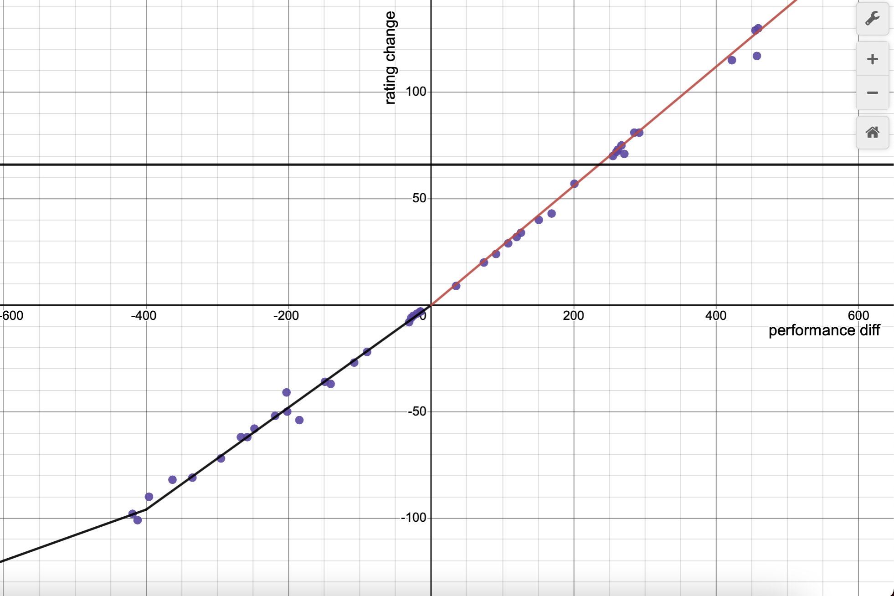

[link back to all posts](https://alxwen711.github.io/blog)

## October 1st-15th

Note: My school term is being a massive pain at the moment and has required most of my waking time nowadays. Apologies if the next few entries feel more rushed than usual.

After manually estimating performance ratings over the last 9 months, I have the results graphed out here:

Each purple dot represents one ranked contest I have participated in on CodeForces. Based on these results I created a linear piecewise approximation to estimate performance based on rating change. This method is usually within 20 points of the method I’ve been using before so I’ll be switching, but past calculations are archived on the stat sheet.

School is beginning to be much more heavy, and the 5 contests I was able to do in the last two weeks are less the expectation and more an anomaly. From here on out every contest matters just as much as each waking hour for me to navigate the hardest school term I’ll ever have.

### [Round 824](https://codeforces.com/contest/1735)

Problems Solved: B, A, C, D

New Rating: **1790** (-19)

Performance: **1730**

*Anytime I complete a full A through D solve on a contest is usually a good sign, and this was no exception.*

And in the next contest right after I wrote that, I lose rating. Well then. The loss here was caused not by missing questions I should’ve gotten but more just sloppy execution. Solving [B](https://codeforces.com/contest/1735/problem/B) before [A](https://codeforces.com/contest/1735/problem/A) was mainly me getting confused over edge accuracy issues, which I still ended up getting a wrong submission for, but then there’s [Problem D](https://codeforces.com/contest/1735/problem/D)

 How to mind block on Problem D (solution spoilers)

The solution is quite simple; each set must contain exactly 3 cards, and each meta set contains 5 cards in total, thus each meta set will contain 2 sets with one card being the uniting card. Thus a simple method is to count how many times each card appears in a set. If a card appears once, it is the uniting card of 0 metasets, a card with 2 set appearances unites 1 distinct metaset, 3 set appearances unites 3 distinct metasets, and n set appearances unites n(n-1)/2 metasets. 
As for why it took me half an hour to figure this part out when the harder part is determining all the possible sets? The example diagram circled entire metasets instead of just sets. So for some reason I kept trying to think of how the number of times each card appears in a metaset has to do with the number of metasets. 

Well, at least I got a full A-D solve?

### [Round 825](https://codeforces.com/contest/1736)

Problems Solved: A, C1, B

New Rating: **1716** (-74)

Performance: **1482**

Had I solved [Problem B](https://codeforces.com/contest/1736/problem/B) without going on a psycho half an hour onslaught with SEVEN wrong answers, the main focus of this recap would’ve been my attempts on the later problems [C2](https://codeforces.com/contest/1736/problem/C2) and [D](https://codeforces.com/contest/1736/problem/D). Instead, I ended up a victim of SpeedForces and what could’ve been a top 600 finish now becomes yet another screwed contest. Most of B’s errors were just incredibly sloppy mistakes in logic, and even if I did not see the relatively simple solution, having 7 wrong submissions means something really screwed up. I guess there is consolation in the fact that I did end up solving B, but I’m normally supposed to do well in SpeedForce type contests. The 11 contests since my breakout run have been as follows:

- Edu Round 134: Sloppy B and C execution, missed D, dropped out of CM
- Round 818: Choked CM due to 7th maths fail and implosion on basic syntax
- Round 819: Topics I’m weak at, at least it was unrated and went okayish
- Edu Round 135: Python dictionaries punch me in the gut
- Round 821: A clown show, barely figured out A
- Round 822: 5am contest that was actually good
- Round 823: Missed D, system failed B, worst in two months
- Edu Round 136: Strategic misplays, but still good A-C solve I guess?
- Global Round 22: An actually good A-D solve
- Round 824: Ugly A-D
- Round 825: SpeedForced, B implosion

I’ve had only ONE Candidate Master level performance in the last 10. Not to mention 4 that were sub Expert. One or two poor contests is bad luck. A 6 week span where I have two, maybe three good contests and the rest poor to atrocious is a serious problem. 

There isn’t much sense in continuing with an aggressive participation strategy. I at least have the benefit that I won’t miss many rated contests since I can’t join most of the ones in the rest of this month, but there are serious flaws I need to address here. I’m not stepping back from competitive programming, but more I need to specifically practice on what was once my strength of having a solid foundation that allowed me to breeze through A-C, because I sure as hell don’t show that nowadays. I’m planning for my next contest to be the open rated contest on October 30th, hopefully by then I can regroup myself mentally.

_Oct 23rd edit: The schedule for contests has been updated since and the likely next contest will be on Novemeber 6th. As such no contests will be recapped in the next entry. I'll probably instead write on a few practice problems I've done and the plan for the last 2 months. Assuming my current school term allows me any time to do so._

## October 16th-31st
I closed off last post by stating I would take an actual break from rated CodeForces contests until at least the 30th, and for once I actually followed through on this, even if it was mainly due to the fact that I was having midterms in this time. Instead of grinding more live CodeForces contests and risking further tilt, I pretty much went through more or less a three step process to recollect myself for the final two months of 2022.

### Mental Recollection/Reset

What I did not mention from the last post is that a few days after the Round 825 debacle, I attempted a self imposed practice contest described as follows in this personal log:

*For Sunday’s training exercise, I will set up 10 problems rated 1400 to 1699. The goal will be completing all of these contest style in the shortest amount of time possible, or until 3 hours have passed. Each problem will be timed, and if I do not have a solution in 45 minutes, it is passed and marked as TLE. The 10 problems chosen will be from Division 1+2 contests to fully emulate real question styles I could find.*

Seems reasonable enough at first since 1400-1699 rated problems were where most of my woes were in past contests. The volume was a bit high but this was with the intent of building mental endurance.

Let’s just say that this training excursion meant to build confidence did not work out. My initial expectation was to solve the first 6-7 problems in 3 hours. What ended up happening was 3 solves in 3 hours. Note that I also looked through all 10 problems as well, so these were the problems I perceived as the “easiest”. There really isn’t much of a point going into what blunders I made in my solving attempts because that day the cause of those blunders was obvious. I was completely burnt. When you have a bad contest due to forgetting something basic that’s one thing, but a long streak of underperforming due to missing basic concepts is tilt. Thus after that contest, I took an actual break. Up until Halloween I did not look at a single CodeForces problem intentionally, with the intent to refresh myself and recollect myself mentally. Writing this at the end of the month I can say that this helped me mentally to compose myself; previous posts were already an indication that I was focusing more on my mistakes and failures out of anger rather than trying to understand why they happened, which is never a way to improve. Taking a break from CodeForces was needed, and now I feel ready again to compete.

### Learning New Concepts (Outside of CodeForces)

Even though I took a break from CodeForces, it does not mean I stepped away from competitive programming entirely. Going completely cold into a contest in November would be a setup for failure, so I took these two weeks to review various concepts. Most of this was with the SFU Competitive Programming Team where several practice contests were done on vjudge. Topics looked at in the last two weeks focused around strings and geometry, the latter being a weaker point of mine. I was also able to retrain my consistency on easier problems; I do mention this a lot, but being strong at fundamentals is probably the most important aspect for mastering anything.

At the end of these two weeks I had learnt various methods on solving geometry problems more easily. I’m now ready for CodeTON Round 3 on November 6th, but to finish my preparation, I did a virtual contest on CodeForces.
 
### [Round 829](https://codeforces.com/contest/1754) Practice Run

Problems Solved: A, B, C2, C1, D

Performance: **1710**

The fast A and B are a good sign, and even if [Problem D](https://codeforces.com/contest/1754/problem/D) was only 1600 in difficulty (maybe the lowest I’ve ever seen), solving it in 20 minutes is well done. Only [Problem C](https://codeforces.com/contest/1754/problem/C2) had significant issues. C was split into a easy and hard version, and I did take the right strategy of going straight for C2 since I was confident I would get it. My mistake was thinking that a fail on C2 meant that the solution could pass on C1, this led to losing 100 points unnecessarily from 2 wrong submissions on C1 due to baseless hope. I also shot myself in the foot badly with my [second attempt](https://codeforces.com/contest/1754/submission/178745442) by inexplicably assuming that if the array sums to 0, having the entire array as a single segment is a solution where it should be every element is its own segment. I did find this mistake after 15 minutes which is quick compared to past blunders. In all, this was a good refresher contest, and had this been rated, I would have lost 1 ELO to go to 1713. It’s still better performance wise than 5 of my last 10 rated contests, and more importantly, I am ready to regain CM now.
