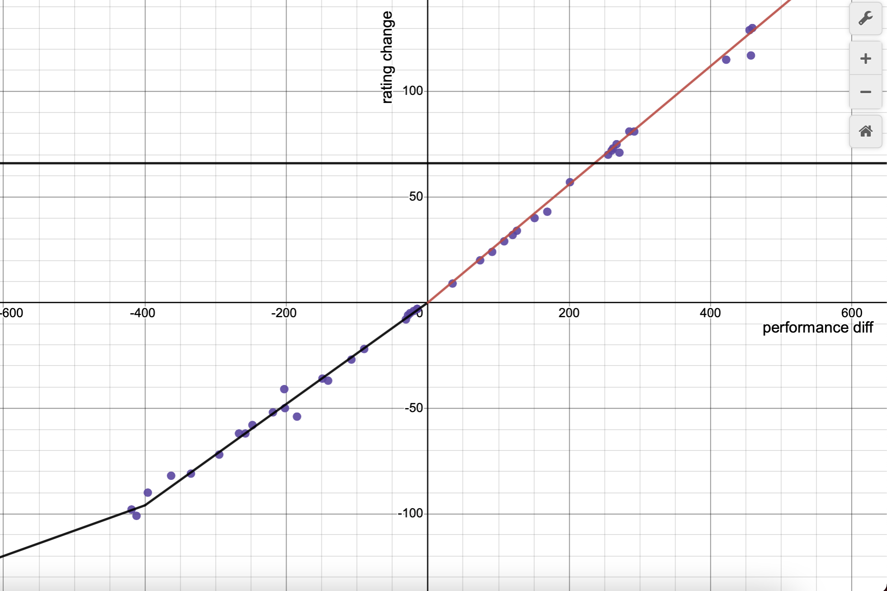

[link back to all posts](https://alxwen711.github.io/blog)

## October 1st-15th

Note: My school term is being a massive pain at the moment and has required most of my waking time nowadays. Apologies if the next few entries feel more rushed than usual.

After manually estimating performance ratings over the last 9 months, I have the results graphed out here:

Each purple dot represents one ranked contest I have participated in on CodeForces. Based on these results I created a linear piecewise approximation to estimate performance based on rating change. This method is usually within 20 points of the method I’ve been using before so I’ll be switching, but past calculations are archived on the stat sheet.

School is beginning to be much more heavy, and the 5 contests I was able to do in the last two weeks are less the expectation and more an anomaly. From here on out every contest matters just as much as each waking hour for me to navigate the hardest school term I’ll ever have.
### [Round 824](https://codeforces.com/contest/1735)

Problems Solved: B, A, C, D

New Rating: **1790** (-19)

Performance: **1730**

*Anytime I complete a full A through D solve on a contest is usually a good sign, and this was no exception.*

And in the next contest right after I wrote that, I lose rating. Well then. The loss here was caused not by missing questions I should’ve gotten but more just sloppy execution. Solving [B](https://codeforces.com/contest/1735/problem/B) before [A](https://codeforces.com/contest/1735/problem/A) was mainly me getting confused over edge accuracy issues, which I still ended up getting a wrong submission for, but then there’s [Problem D](https://codeforces.com/contest/1735/problem/D)

 How to mind block on Problem D (solution spoilers)

The solution is quite simple; each set must contain exactly 3 cards, and each meta set contains 5 cards in total, thus each meta set will contain 2 sets with one card being the uniting card. Thus a simple method is to count how many times each card appears in a set. If a card appears once, it is the uniting card of 0 metasets, a card with 2 set appearances unites 1 distinct metaset, 3 set appearances unites 3 distinct metasets, and n set appearances unites n(n-1)/2 metasets. 
As for why it took me half an hour to figure this part out when the harder part is determining all the possible sets? The example diagram circled entire metasets instead of just sets. So for some reason I kept trying to think of how the number of times each card appears in a metaset has to do with the number of metasets. 

Well, at least I got a full A-D solve?

### [Round 825](https://codeforces.com/contest/1736)

Problems Solved: A, C1, B

New Rating: **1716** (-74)

Performance: **1482**

Had I solved [Problem B](https://codeforces.com/contest/1736/problem/B) without going on a psycho half an hour onslaught with SEVEN wrong answers, the main focus of this recap would’ve been my attempts on the later problems [C2](https://codeforces.com/contest/1736/problem/C2) and [D](https://codeforces.com/contest/1736/problem/D). Instead, I ended up a victim of SpeedForces and what could’ve been a top 600 finish now becomes yet another screwed contest. Most of B’s errors were just incredibly sloppy mistakes in logic, and even if I did not see the relatively simple solution, having 7 wrong submissions means something really screwed up. I guess there is consolation in the fact that I did end up solving B, but I’m normally supposed to do well in SpeedForce type contests. The 10 contests since my breakout run have been as follows:

- Edu Round 134: Sloppy B and C execution, missed D, dropped out of CM
- Round 818: Choked CM due to 7th maths fail and implosion on basic syntax
- Round 819: Topics I’m weak at, at least it was unrated and went okayish
- Edu Round 135: Python dictionaries punch me in the gut
- Round 821: A clown show, barely figured out A
- Round 822: 5am contest that was actually good
- Round 823: Missed D, system failed B, worst in two months
- Edu Round 136: Strategic misplays, but still good A-C solve I guess?
- Global Round 22: An actually good A-D solve
- Round 824: Ugly A-D
Round 825: SpeedForced, B implosion

I’ve had only ONE Candidate Master level performance in the last 10. Not to mention 4 that were sub Expert. One or two poor contests is bad luck. A 6 week span where I have two, maybe three good contests and the rest poor to atrocious is a serious problem. 

There isn’t much sense in continuing with an aggressive participation strategy. I at least have the benefit that I won’t miss many rated contests since I can’t join most of the ones in the rest of this month, but there are serious flaws I need to address here. I’m not stepping back from competitive programming, but more I need to specifically practice on what was once my strength of having a solid foundation that allowed me to breeze through A-C, because I sure as hell don’t show that nowadays. I’m planning for my next contest to be the open rated contest on October 30th, hopefully by then I can regroup myself mentally.

## October 16th-31st

