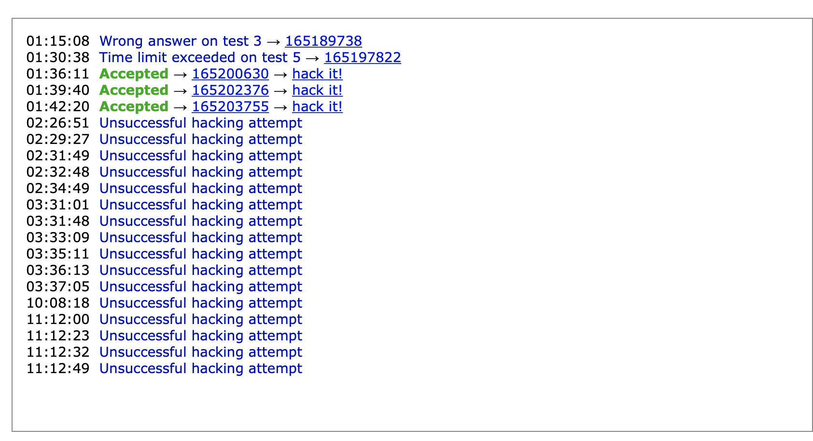

[link back to all posts](https://alxwen711.github.io/blog)

## September 1st-15th

As of posting this, I’ll be back to school in a 6 course term. This means that my time for competitive programming in the next four months is limited at best, and with the “contest” that occurred at the end of August, I need to make every contest count to return to CM (1900 ELO).

### [Round 818](https://codeforces.com/contest/1717)

Problems Solved: A, B, C, D

New Rating: **1880** (-3)

Performance: **1868**

I’m not sure if I’m being too hard on myself, or it’s been a poor mentality I’ve recently been having, or both, but even though this is statistically the 8th best contest I’ve had, I’m still not happy with this result. Yes, I solved A through D, but [Problem C](https://codeforces.com/contest/1717/problem/C) should not have taken 38 minutes to solve. The 38% clear rate it had puts it on the easier end of C problems, and I spent an egregious amount of time stumbling by overcomplicating my attempted solutions. Mainly, I was trying to find how to turn array A to array B when what I should’ve been doing was determining if it was possible to turn array A into array B. These two ideas are clearly different. For instance, if I asked you to determine if `987.83979*202.100971503 > 1000` is true, you would use common sense/basic estimation to determine that the answer is “yes”. What you would not do is manually take out a piece of paper and start creating abstract art in the name of “common core multiplication” to determine the exact value, then compare that to 1000. Solve only what the problem requires you to solve.

Then we go to [Problem D](https://codeforces.com/contest/1717/problem/D). I’ll give credit to myself for figuring out the solution because noticing how Pascal’s triangle is involved with this problem is actually well done. I’ll also excuse myself for the unsuccessful hacking attempt I desperately made since the benefits of potentially passing 92 other coders was worth the risk of dropping 32 places. What cannot be excused is how I had 4 wrong submissions for this problem.

*Note: originally I was going to excuse the first wrong submission because I was unsure why it inexplicably failed on test case 8. It is now 6 hours after the contest and put simply, I’m just sad now. The next paragraph may contain excessive amounts of salt.*

The [first submission](https://codeforces.com/contest/1717/submission/170630493) fail can be described as follows:
```
Let a = 2, b = 5, c = 3
My line of code: a = a + b % c

What I assumed would happen:
a = (2 + 5) % 3 = 7 % 3 = 1

What ended up happening:
a = 2 + (5 % 3) = 2 + 2 = 4
```

Yeah, instead of failing due to not being able to count to five, now I only failed due to 7th grade mathematics. I assume that’s when modular arithmetic is introduced. Oh but wait! What about the other wrong submissions? [Number 2](https://codeforces.com/contest/1717/submission/170633298) I thought my factorial algorithm that I took directly from my [competitive library](https://github.com/alxwen711/pythonCompetitiveLibrary/blob/main/algorithms/math/combinatorics/fermatCombinatorics.py) was bugged so I increased the memory allocated for no reason, EVEN THOUGH I already did extensive testing to confirm the algorithm was accurate. [Number 3](https://codeforces.com/contest/1717/submission/170634542)? Oh boy. I fixed the modulo error unknowingly and reverted the edit from the second submission, but OH BOY WHAT DID I REPLACE THE LINE WITH???

`arLen = max(n+k)+3 #array length`

Wow. I guess now we’re imploding on basic aspects of Python now. Note that if I had ran the program on the 3 given pretests this would have been caught, but instead I lost 50 more points for failing a pretest that is literally visible in the problem description. You think I’d realize this after seeing “Runtime error on pretest 2”, but nope. For [submission 4](https://codeforces.com/contest/1717/submission/170634783), what did I think the error was??? I thought `print(ans%m)` wasn’t working properly. Now excuse me while I go scream at this disaster class in a corner somewhere.

Okay I’m done screaming. Here’s the real kicker behind the Problem D disasterclass:

- I ended up with 3676 points at the end of the contest, landing me in 668th place with an 1868 ELO performance.

- 1088 of those points came from Problem D.

- Had I not made the modulo blunder, I would’ve had a successful submission for D 1:18 in the contest, netting me 1376 points.

- Furthermore, I would not lose an additional 50 points because the hacking attempt I made was one out of desperation to reach a performance level just good enough to reach CM.

- Thus, the blunder cost me 338 points and had it not happened, I would finish this contest with 4014 points.

- 4014 points would equate to 380th place, an approximate performance of 2004 ELO (1709 base + 82 net gain * 3.6)

- A 2004 ELO performance would’ve given me about a 34 ELO gain bringing me to 1917 ELO.

- Even if I made that first wrong submission, had I corrected it on my second attempt, I would still be at 3936 points -> 443rd place -> 1966 ELO performance -> 23 ELO gain -> 1906 ELO -> Still CM

Agony, thy name is 7th grade modular arithmetic.

### [Round 819](https://codeforces.com/contest/1726)

Problems Solved: A, B, C

~~New Rating: **1870** (-10)~~

~~Performance: **1840**~~

*EDIT: It turns out Problem F was copied from a past contest, so this entire contest is unrated. At least I didn’t lose rating?*

Contests like these are why I was so mad over how rubbish I performed on the previous round. In the previous round, Problem C was a greedy problem where the induction step was the main challenge, and Problem D was a combinatorics problem where my success depended on finding a pattern. Both of these questions played directly into my strengths, so I should’ve been able to reach CM. 

For this contest, [Problem C](https://codeforces.com/contest/1726/problem/C) was solved mainly due to luck. My solution that involved counting the number of “()” in the sequence was me throwing ideas randomly. I did not even bother trying [Problem D](https://codeforces.com/contest/1726/problem/D) because I found [Problem E](https://codeforces.com/contest/1726/problem/E) more approachable. D was a graph/tree problem that took me 10 minutes to understand the problem statement, and even after that I had no clue how to begin. E turned out to not be much better as one of the problem tags for this question was fast fourier transform, something I still have no clue of. My attempts at E involved finding the answer for small n values to create some sort of pattern. For 2 to 9, I got `[2,4,12,32,100,312,1076,3772]`. I suspect there is some sort of recurrence relation here but I could not find it. I have attempted this sort of method of brute forcing small n values to see a pattern before with mixed success, but here I feel this idea may have been a pitfall. I also attempted to find some sort of dp method for E but nothing was found.

With C being a lucky solve, D being a graph problem, and E requiring a technique I have no clue of, this contest was better executed than the previous one. Yes it was worse overall, but my only mistakes were a slow B solve and rushing my first attempt on C. It still hurts though that I’m only ~~30~~ 20 points away from CM, but with school starting tomorrow (September 7th), it feels so far away.

This blog was posted a week early, mainly due to the fact that there are no more contests coming in this two week period. I am starting classes at SFU again, 6 in fact. You can still expect frequent activity on other Github projects I’m working on as well as the rating post sometime at the end of this month. Alas, my goal of returning to CM by the end of this year is significantly harder now due to fewer contests and having much less time than normal to prepare. 

### September 8th update

Well, it turns out I’m incompetent when it comes to reading CodeForces schedule, because it turns out there was a contest today. Even better, my classes start later on Thursdays so I conveniently was able to attend today’s round. Let’s see how it went.

### [Educational Round 135](https://codeforces.com/contest/1726)

Problems Solved: A, B, ~~C,~~ D

New Rating: **1808** (-72)

Performance: **1585**

On second thought, I’d say it’s just best to end this entry here.

Okay fine, I’ll explain what happened. The contest opened with a strong Problem A-C solve in 30 minutes that had no major errors. Yes, there is a massive issue I’m ignoring here, we’ll discuss that, but first let me how I did [Problem D](https://codeforces.com/contest/1728/problem/D). I approached this question perfectly.

The first thing I noticed is that the input size is much smaller than normal; the number of characters *s* will be at most 2000. 2000^2 is only 4 million, so an O(n^2) will actually be fast enough. O(n^2) is special because it means that a dp approach is more likely since 2d array representation usually won’t timeout. That said, I tried finding a greedy option first that involved trying to pick the best move for each player in a game. I soon realised that most of my greedy attempts were incredibly scuffed, and that a game with a 2 character string is trivial: if both characters are the same, the game is a draw, else Alice wins. From there, a dp approach can be used to calculate the result for 4-char substrings, 6-char substrings, and so on.

Using an example, consider the string `abbcca`. The algorithm determines that `ab`,`bc`, and `ca` are wins for Alice, while `bb` and `cc` are draws. This info is represented in the array `[1,0,1,0,1]`, where 1 = Alice and 0 = Draw. Now consider the 4 character strings. The first one is `abbc`, and only the middle 2-char substring `bb` is a draw. However `abbc` is not a draw because even though Bob can force `bb` to be the remaining string, Alice could choose the `a` from earlier to finish with a string of `ba` to Bob’s `bc`. Thus `abbc` = 1. `bbcc` however is a draw because if Alice chooses b, Bob copies to get to `cc`, and if Alice chooses c, Bob copies to get to `bb`; both of these scenarios play out in a draw. For `bcca`, similar logic to `abbc` applies to show this is a win for Alice. This info is stored as `[1,0,1]`

This leaves the main string `abbcca`. Note that Alice choosing from the left leaves either a draw or win [0,1], and choosing from the right leaves either a win or draw [1,0]. Since the middle 4 characters lead to a draw, and the end characters are equal, the entire string is a draw. The array notation I used to track this data also helps in simplifying the logic for the program.

Thus concludes my Problem D approach. I even had the right idea for [Problem E](https://codeforces.com/contest/1728/problem/E). You can find the maximum value for using x red peppers and n-x black peppers by first tracking the difference in tastiness between the two for each dish. Then find the total tastiness when using n red peppers, and then swap in black peppers from most to least effective to get the best result for every combination. This part can be done in O(n log n), and each shop query is likely solvable in O(log n) time each by using Euclid’s algorithm to solve each Diophantine equation. Unfortunately, I was running short on time to implement this part, and resorted to a brute force to attempt a hail mary solve. The submission made it past 6 test cases before TLE occurred, so it’s safe to assume I had the right approach.

And then there’s [Problem C](https://codeforces.com/contest/1728/problem/C). Had I not been hacked, my submission would have fully passed the test cases, I would have gained about 30 ELO, and I’d be writing this contest as a storybook ending where I finally return to CM again. [I even resubmitted the original solution to confirm this](https://codeforces.com/contest/1728/submission/171539249). Alas, I’m now 92 ELO out of CM, and only a miracle can really get me back there before this year ends. (I’d need another Master level performance to make it back, or several CM performances. Both are longshots at best right now.) The cause of this successful hack is due to how Python hashmaps work. Hashmaps are incredibly useful for key value pairs by using additional memory for O(1) lookups. However, this is only possible if the hash function maps keys to the hashmap’s memory in a relatively even distribution. For most datasets this isn’t a problem, but specific key values will cause many hash collisions, which tl;dr, makes the lookup go from O(1) to a worst case O(n). This can make a program slow down to O(n^2), but this is incredibly unlikely for random number sequences. In fact, you’d need a key sequence intentionally designed in a way that makes the hash function map keys all map to the same value to cause an O(n) blowup.

You can probably tell what happened. It turns out the hash function for Python is simple enough that the following code can generate an array of values that can cause such a blowup:

```python
def screwpythonhashtables():
    arr = []
    mask = (1 << 17) - 1
    fill = int((1 << 15) * 1.3 + 1)

    arr = []
    # arr = [1]*199998
    arr += [mask + 2] * 2
    x = 6
    for i in range(1, fill):
        arr += [x] + [x]
        x = x * 5 + 1
        x = x & mask

    arr += [1] * (n - len(arr))
```  

For future contests a possible solution is to run all values used for a hashmap in a self made hash function to generate a more even distribution of values. I’m currently working on such a solution to be added to the Python comp lib, partially because it’s important, and partially because I’m still hurting over this contest. Also, such hashmap hacks also exist in C++, so programming language was never the issue. With school already loading up work on me at a rapid pace, I’ll be lucky if I have the time to join CodeForces contests consistently in these next 4 months, let alone have actual practice time. And to think that a hashmap exploit, the last thing on my mind immediately after that contest, would be why I’m sad now. I think this past excerpt from August is fitting here:
*Oh, and I haven’t even mentioned this yet:*



*As if the near TLE shenanigans weren’t enough for my blood pressure, a total of ****16**** attempts from 5 different people were made to break my solution. AND my solution defended all of them successfully. Just about every attempt made was to try and make my solution exceed the time limit, and the closest any of them got was about 882ms. If anyone who tried hacking my solution is reading this, then to you specifically, thank you for trying to hack me, defending all of the hacking attempts actually felt good.*

The inverse really is true. Defending a hack makes you feel amazing, while being hacked is about the worst feeling imaginable on CodeForces. As a final note, please do not search or harass the person who hacked me; hacking on CodeForces is an innovative and fair aspect of the contests. If you do hack someone, you deserve the reward of increasing your own rank in the contest, and if you are hacked, then your solution failed a legitimate test case within the constraints of the problem and doesn’t deserve to be correct. That said, this sort of pain is nothing like the rage I felt over Round 818. It’s more of an agonising sadness that tears at you, like finally qualifying for a national sports competition two weeks away, only to get in a car crash hospitalising you long term. It is hyperbole, but unfortunately, it’s been two days since that contest as of writing this, and I don’t think I’ll forget this moment anytime soon.

## September 16th-30th

